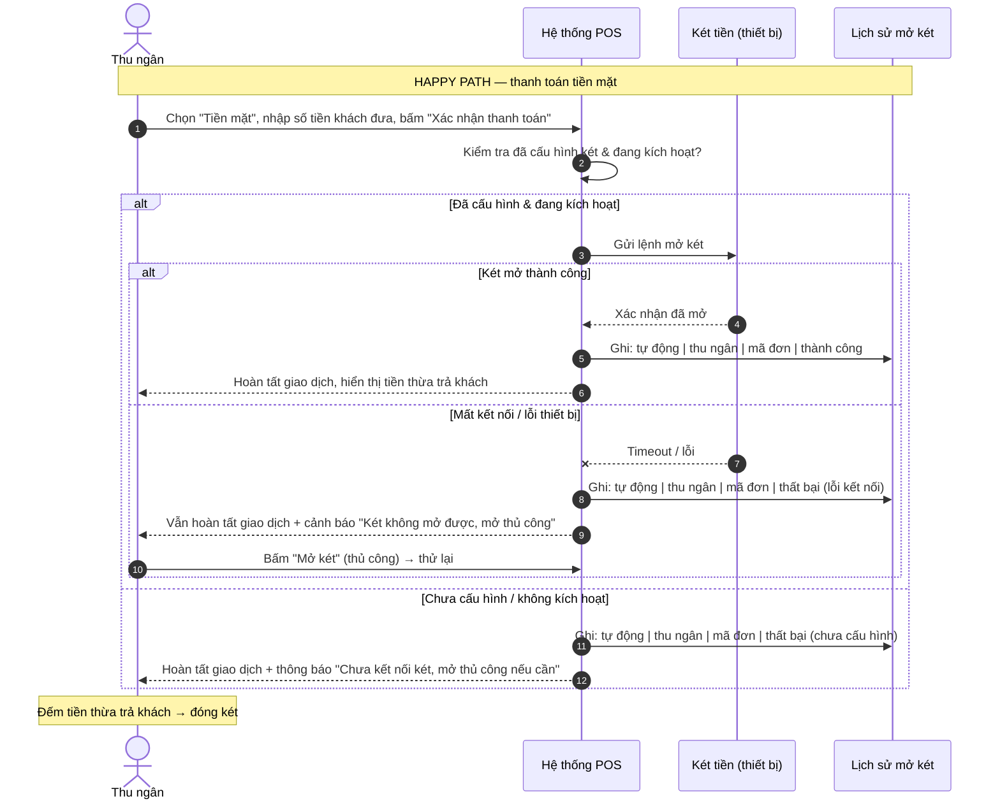
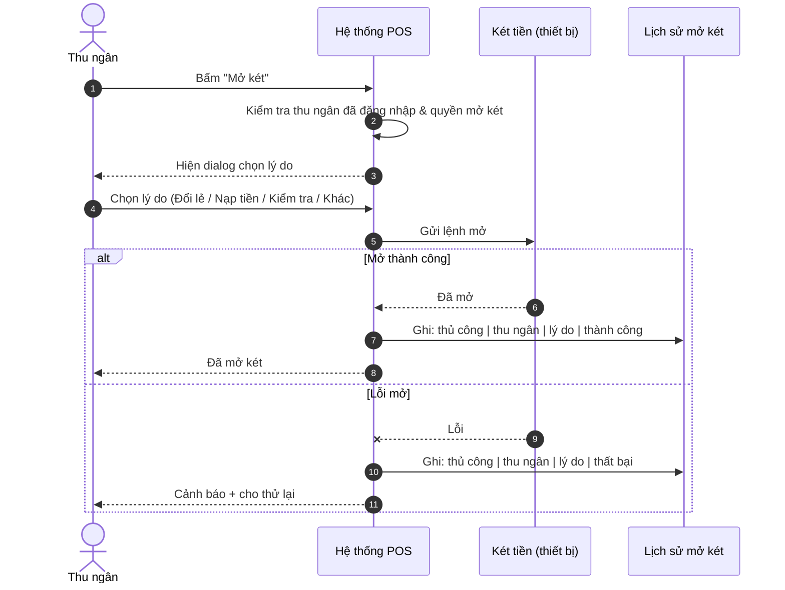
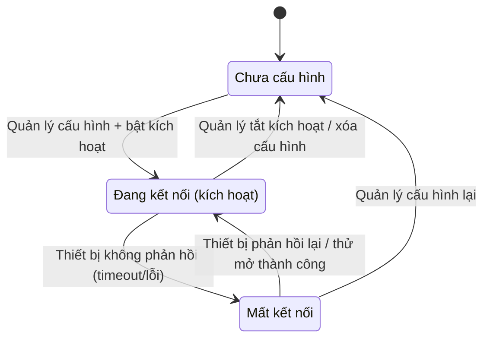

# Sơ đồ tương tác: Cash Drawer (Kết nối két tiền & Tự động mở khi thanh toán tiền mặt)

## 1. Sequence Diagram — Mở két tự động khi xác nhận thanh toán tiền mặt

## 2. Sequence Diagram — Mở két thủ công

## 3. State Diagram — Trạng thái kết nối két tiền

> **Lưu ý:** Nhánh "két đã mở sẵn" (BR-12) và "xác nhận mở thành công" phụ thuộc việc thiết bị có cảm biến trạng thái — xem OQ-01. Nếu két không có cảm biến, hệ thống ghi nhận kết quả "best-effort" (chỉ ghi kết quả gửi lệnh).
