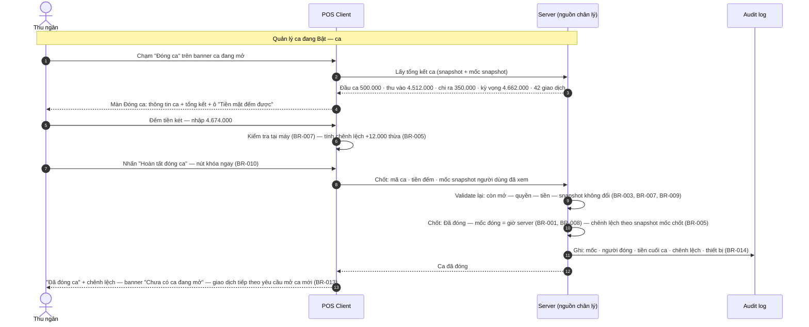
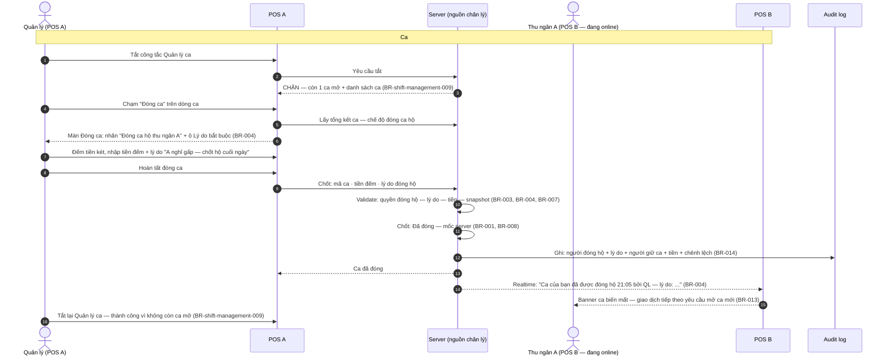
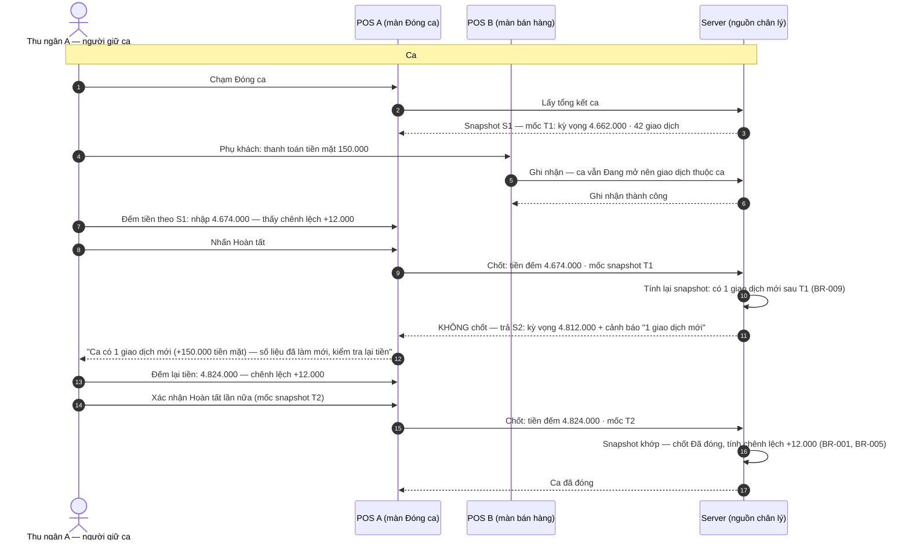
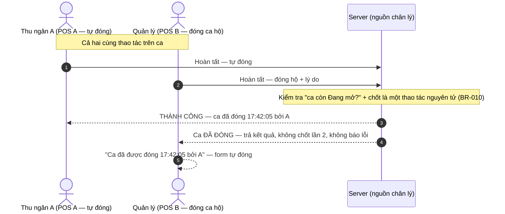
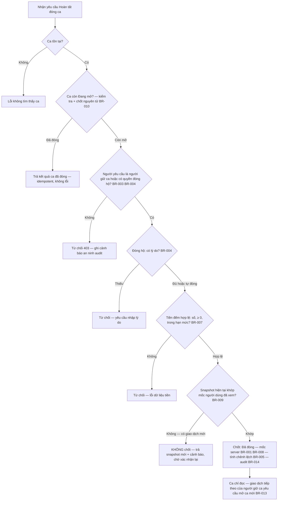

# Sơ đồ tương tác: Đóng ca (Close Shift)

> BR-00x trong file này là rule của spec Đóng ca (`spec.md`); rule của spec Bật/Tắt và spec Mở ca dẫn dạng đầy đủ `BR-shift-management-NNN`, `BR-open-shift-NNN`.

## 1. Sequence Diagram — Đóng ca thành công (happy path)

> **Lưu ý:** vào màn đối soát lúc 17:30 nhưng Hoàn tất lúc 17:42 thì mốc đóng là **17:42** — lấy tại server lúc chốt thành công (BR-008), đối xứng với BR-open-shift-004 của mở ca.

## 2. Sequence Diagram — Đóng ca hộ (quản lý, từ dialog chặn tắt)

> **Lưu ý:** quản lý đếm tiền thực tế thay và chịu trách nhiệm số liệu nhập; người giữ ca xem được lý do trong chi tiết ca (Mục 6.3 spec). Nếu thu ngân không online: nhận in-app notification khi quay lại, kèm bản ghi trong chi tiết ca — không push notification hệ điều hành GĐ1 (OQ-05 resolved).

## 3. Sequence Diagram — Có giao dịch mới trong lúc đang đối soát (BR-009)

> **Lưu ý:** nếu không có cơ chế này, server chốt theo snapshot mới (kỳ vọng 4.812.000) trong khi người dùng nhập số đếm theo snapshot cũ (4.674.000) — chênh lệch hiển thị −138.000 **thiếu** một cách sai lệch. Cơ chế không ép đếm lại; nó đảm bảo người đóng xác nhận trên số liệu mới nhất trước khi chốt (Mục 8.2 spec).

## 4. Sequence Diagram — Hai yêu cầu hoàn tất gần đồng thời (BR-010)

> **Lưu ý:** request thua cuộc không phải lỗi — hiển thị kết quả ca đã đóng kèm người đóng và mốc (BR-010, Mục 7.2 Case 2 spec).

## 5. State Diagram — Vòng đời ca

```mermaid
stateDiagram-v2
    direction LR
    state "ĐANG MỞ — nhận giao dịch dòng tiền của người giữ ca (BR-open-shift-010)" as Mo
    state "ĐÃ ĐÓNG — chỉ đọc: xem lịch sử, báo cáo; không mở lại (BR-013)" as Done

    [*] --> Mo: Mở ca thành công — mốc server (use case Mở ca)
    Mo --> Done: Hoàn tất đóng ca — server chốt thành công (BR-001, BR-008)
    Done --> [*]
```

> **Lưu ý:** quá trình nhập đối soát **không** làm ca rời trạng thái Đang mở (BR-002) — "đang đối soát" là trạng thái quy trình trên màn hình, không phải trạng thái dữ liệu của ca. Thoát giữa chừng: ca vẫn Đang mở. Không có trạng thái nháp/hủy/đóng dở; ca đã đóng không được mở lại — muốn làm tiếp thì mở ca mới.

## 6. Flowchart — Quyết định Hoàn tất đóng ca (tại server)

> **Lưu ý:** hoàn tất không kiểm tra cấu hình Bật/Tắt (BR-012) — ca đang mở luôn đóng được; Tắt Quản lý ca chỉ thành công khi không còn ca mở (BR-shift-management-009) nên hai thao tác không xung đột.
