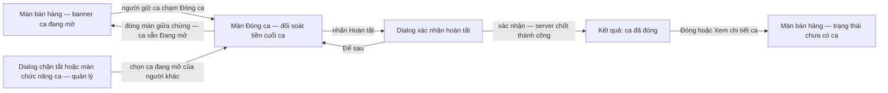

# Đặc tả màn hình: Đóng ca (Close Shift)

## 1. Bản đồ màn hình & điều hướng

| Màn | Điều kiện vào | Thoát |
| :--- | :--- | :--- |
| 1. Điểm vào Đóng ca (banner / màn chức năng ca / dialog chặn tắt) | Quản lý ca Bật + tồn tại ca Đang mở | Vào màn Đóng ca, hoặc rời màn |
| 2. Đóng ca (đối soát tiền cuối ca) | Từ điểm vào mục 1 — tự đóng hoặc đóng ca hộ | Hoàn tất thành công, Đóng màn (ca vẫn Đang mở), hoặc ca bị người khác đóng (form tự đóng) |
| 3. Dialog xác nhận hoàn tất | Nhấn Hoàn tất trên màn Đóng ca | Xác nhận (gửi chốt) / Để sau (quay lại màn 2) |
| 4. Kết quả đóng ca + thông báo bị đóng hộ | Server chốt thành công | Đóng / Xem chi tiết ca (use case Lịch sử ca) |

## 2. Màn 1 — Điểm vào Đóng ca

**Mục đích:** cho người giữ ca vào thao tác đóng ca của mình; cho quản lý vào đóng ca hộ.

| Thành phần | Nội dung / Hành vi |
| :--- | :--- |
| Banner ca đang mở (màn bán hàng) | "Ca đang mở — {tên nhân viên} — từ {giờ mở}" + nút **Đóng ca** — chỉ hiện với ca của **chính người dùng** (kế thừa screens spec Bật/Tắt) |
| Màn chức năng ca (quản lý) | Danh sách ca đang mở của cửa hàng (người giữ, mở lúc, thiết bị mở) + nút **Đóng ca** mỗi dòng — vào chế độ đóng ca hộ |
| Dialog chặn tắt (Cài đặt) | Khi tắt Quản lý ca mà còn ca mở: danh sách ca đang mở kèm nút **Đóng ca** — đi thẳng vào màn Đóng ca của ca đó (BR-shift-management-009) |
| Khi cấu hình Tắt | Điểm truy cập nhanh ẩn; tại màn chức năng ca hiển thị khóa + tooltip "Quản lý ca đang tắt" (BR-shift-management-010) |

## 3. Màn 2 — Đóng ca (đối soát tiền cuối ca)

**Mục đích:** xem tổng kết ca, nhập tiền đếm được và lý do (nếu hộ), xem chênh lệch, hoàn tất đóng ca.

**Thông tin ca (chỉ đọc):**

| Trường | Nội dung |
| :--- | :--- |
| Mã ca | "Ca #23 · mở 08:10" (định dạng kế thừa spec Mở ca) |
| Người giữ ca | Tên + vai trò; chế độ đóng hộ hiển thị thêm nhãn **"Đóng ca hộ {tên} — bạn chịu trách nhiệm số liệu nhập"** (BR-004) |
| Thiết bị mở ca | Tên thiết bị đã mở ca — chỉ tham khảo audit, đóng ở máy nào cũng được (BR-003) |
| Tiền mặt đầu ca | Giá trị ghi khi mở ca |
| Mốc snapshot | "Số liệu cập nhật lúc {giờ} — {N} giao dịch" (Mục 8.2 spec); tự làm mới khi nhận cảnh báo giao dịch mới |

**Tổng kết ca (server tính, chỉ đọc):**

| Trường | Nội dung |
| :--- | :--- |
| Thu tiền mặt vào ca | Tổng thanh toán đơn / phiếu thu / thu nợ bằng tiền mặt thuộc ca |
| Chi tiền mặt ra khỏi ca | Tổng phiếu chi / hoàn tiền bằng tiền mặt thuộc ca |
| **Tiền mặt kỳ vọng** | Đầu ca + vào − ra (BR-005) |
| Thu theo phương thức khác | Thẻ, QR, chuyển khoản, voucher… — chỉ tham khảo, không tham gia chênh lệch (Mục 5.2 spec) |

**Trường nhập:**

| Trường | Quy tắc |
| :--- | :--- |
| Tiền mặt đếm được | Bàn phím số; **bắt buộc nhập** — để trống không kích hoạt Hoàn tất; 0 là giá trị hợp lệ; ≥ 0; không vượt hạn mức (BR-007); kiểm tra ngay khi nhập |
| Lý do đóng ca hộ | Chỉ hiển thị chế độ đóng hộ; **bắt buộc** — thiếu thì nút Hoàn tất không kích hoạt (BR-004) |

**Chênh lệch (hiển thị, tự tính):**

| Thành phần | Hành vi |
| :--- | :--- |
| Giá trị + nhãn | "+12.000 — Thừa" / "−30.000 — Thiếu" / "0 — Khớp" (BR-005); tính lại tức thời khi đổi số đếm |
| Màu | Chỉ hỗ trợ nhận biết, luôn kèm nhãn chữ; không hiển thị chênh lệch như "lỗi" (BR-006) |

**Nút:**

| Nút | Hành vi |
| :--- | :--- |
| **Hoàn tất đóng ca** (chính) | Mở Dialog xác nhận (Màn 3); khi gửi — khóa, đổi nhãn "Đang đóng ca..." (BR-010); không kích hoạt khi tiền không hợp lệ hoặc thiếu lý do hộ |
| **Đóng** | Dialog cảnh báo "Ca vẫn đang mở — thoát bây giờ?" rồi quay lại màn trước; không đổi gì trên server; dữ liệu đã nhập giữ tại máy trong phiên (BR-002) |

**Trạng thái màn:**

| Trạng thái | Hành vi |
| :--- | :--- |
| Đang gửi | Nút Hoàn tất khóa; không sửa ô nhập |
| Lỗi dữ liệu tiền | Báo đỏ dưới ô nhập, không gửi (BR-007) |
| Lỗi server / mất kết nối | Banner lỗi + nút **Thử lại**; dữ liệu đã nhập giữ nguyên (Mục 11 spec case 3–5) |
| Có giao dịch mới trong lúc đối soát | Banner vàng "Ca có {N} giao dịch mới — số liệu đã làm mới, kiểm tra lại tiền và xác nhận"; tổng kết tự cập nhật (BR-009) |
| Ca đã bị người khác đóng | Màn tự đóng; hiển thị kết quả ca đã đóng kèm người đóng + mốc (BR-010) |
| Cấu hình chuyển Tắt khi đang mở màn | Không thể xảy ra khi ca còn mở (BR-shift-management-009); nếu đã Tắt nghĩa là ca đã đóng — nhận kết quả như dòng trên |

## 4. Màn 3 — Dialog xác nhận hoàn tất

**Mục đích:** chốt ý người đóng trước khi gửi — người đóng xác nhận con số mình chịu trách nhiệm.

| Thành phần | Nội dung / Hành vi |
| :--- | :--- |
| Tổng kết đối chiếu | Kỳ vọng · tiền đếm · chênh lệch (giá trị + nhãn thừa/thiếu/khớp) · số giao dịch của ca |
| Lý do (chế độ hộ) | Hiển thị lại lý do đóng ca hộ |
| Cảnh báo snapshot mới | Khi có giao dịch mới: hiển thị **so sánh cũ/mới** (kỳ vọng cũ → mới, số giao dịch cũ → mới) + dòng "Hãy kiểm tra lại tiền trong két trước khi xác nhận" — bắt buộc xác nhận lại trên số mới (BR-009) |
| Nút **Xác nhận đóng ca** | Gửi yêu cầu chốt; khóa nút khi gửi (BR-010) |
| Nút **Để sau** | Đóng dialog, quay lại màn 2 — ca vẫn Đang mở, dữ liệu giữ nguyên |

## 5. Màn 4 — Kết quả đóng ca & thông báo bị đóng hộ

**Kết quả (người vừa hoàn tất thấy):**

| Thành phần | Nội dung |
| :--- | :--- |
| Xác nhận | "Đã đóng ca #23 · 17:42" |
| Chênh lệch | "+12.000 — Thừa" (hoặc Thiếu / Khớp) |
| Nút | **Xem chi tiết ca** (use case Lịch sử ca) / **Đóng** |
| Sau khi đóng | Banner màn bán hàng về "Chưa có ca đang mở" — giao dịch dòng tiền tiếp theo bị chặn yêu cầu mở ca mới (BR-013) |

**Thông báo bị đóng hộ (người giữ ca đang online, nhận realtime):**

| Thành phần | Nội dung |
| :--- | :--- |
| Thông báo | "Ca của bạn đã được đóng hộ lúc {giờ} bởi {người} — lý do: {lý do}" (BR-004) |
| Hệ quả trên máy | Banner ca đang mở biến mất; giao dịch dòng tiền tiếp theo bị chặn yêu cầu mở ca mới (BR-013) |
| Không online | Khi quay lại (đăng nhập lại / mở lại app): **in-app notification** "Ca của bạn đã được đóng hộ lúc {giờ} bởi {người} — lý do: {lý do}"; bản ghi đầy đủ trong chi tiết ca. Không làm push notification hệ điều hành GĐ1 (OQ-05 resolved) |
