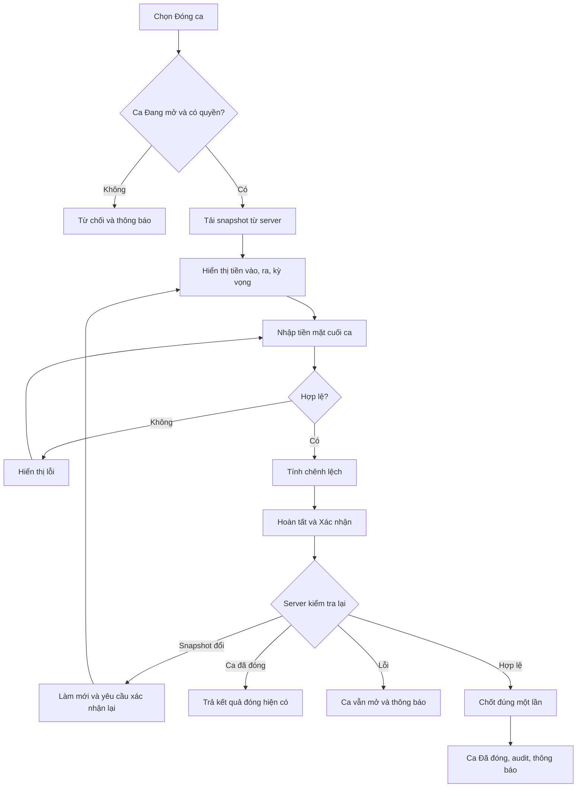
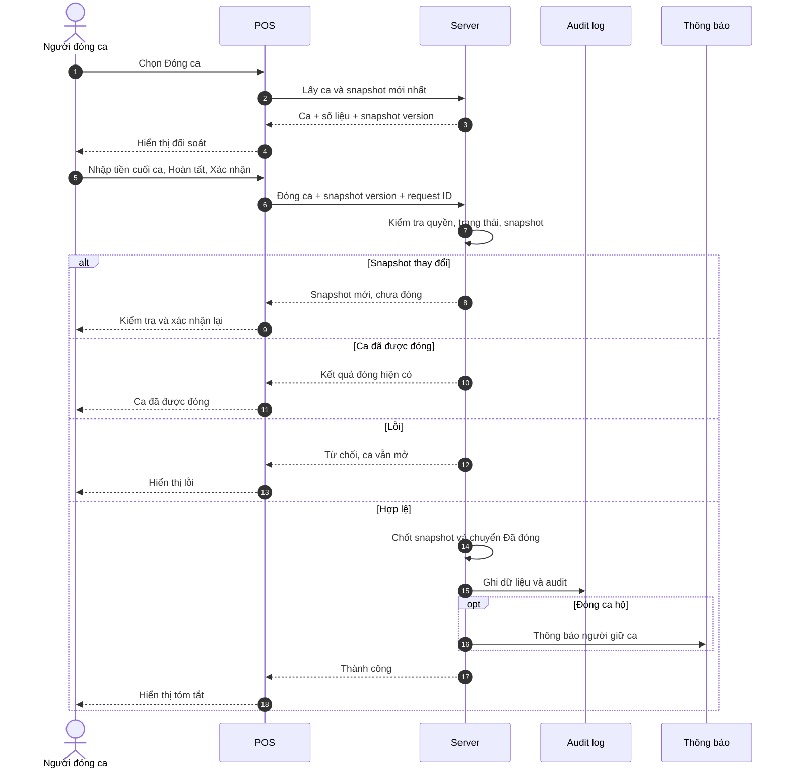

# Use case \- Đóng ca

### **1**. Lịch sử

| Version | Ngày | Người | Cập nhật/Thay đổi |
| :--- | :--- | :--- | :--- |
| 1.1 | 10/09/2026 | BA Team | Chốt đối soát một giá trị Tiền mặt cuối ca cho toàn ca; tiền vào/ra chỉ lấy từ giao dịch tiền mặt hiện có tham chiếu Shift ID. |
| 1.0 | 10/09/2026 | BA Team | Khởi tạo SRS Use case Đóng ca. |

### 2. User story

| ID | User Story |
| :--- | :--- |
| US-CLOSE-01 | Là người giữ ca, tôi muốn đối soát tiền mặt và đóng ca của mình để kết thúc việc ghi nhận giao dịch vào ca. |
| US-CLOSE-02 | Là người có quyền Đóng ca hộ, tôi muốn đóng ca của nhân viên khác và ghi rõ lý do để xử lý ca chưa được tự đóng. |

### 3. Thông tin nghiệp vụ

| **Thông tin nghiệp vụ** | **Chi tiết đặc tả** |
| --- | --- |
| 1. **Mục đích & Phạm vi** | Cho phép người giữ ca hoặc người có quyền Đóng ca hộ kết thúc ca **Đang mở** sau khi đối soát tiền mặt. Phạm vi gồm điều kiện đóng, tự đóng, đóng hộ, đối soát, concurrent, validation, lỗi, audit và thông báo. Giai đoạn 1 không có đóng offline; trạng thái Nháp/Hủy/Đang đóng dở; sửa hoặc mở lại ca; ngưỡng/lý do chênh lệch; cảnh báo ca mở lâu. |
| 2. **Actors** | Người giữ ca; người có quyền Đóng ca hộ; POS; Server; Audit log; Hệ thống thông báo. |
| 3. **Pre-conditions** | Các điều kiện cần đáp ứng: |
|  | 1. Người thao tác đã đăng nhập và tài khoản còn hiệu lực tại cửa hàng. |
|  | 2. Quản lý ca đang **Bật**. |
|  | 3. Ca tồn tại tại cửa hàng hiện tại và đang **Đang mở**. |
|  | 4. Tự đóng: ca thuộc người dùng hiện tại. |
|  | 5. Đóng hộ: người thao tác có quyền **Đóng ca hộ**. |
|  | 6. Thiết bị kết nối được server. |
| 4. **Expected Results** | **Happy Path — Tự đóng ca** |
|  | 1. Người giữ ca chọn **Đóng ca**. |
|  | 2. Hệ thống kiểm tra điều kiện và lấy snapshot mới nhất từ server. |
|  | 3. Hệ thống hiển thị thông tin ca, Tiền đầu ca, Tổng tiền vào, Tổng tiền ra và Tiền mặt kỳ vọng. |
|  | 4. Người dùng nhập **Tiền mặt cuối ca**, kể cả `0`. |
|  | 5. Hệ thống validate và tính **Chênh lệch = Tiền mặt cuối ca − Tiền mặt kỳ vọng**. |
|  | 6. Hệ thống hiển thị Khớp/Thừa/Thiếu. |
|  | 7. Người dùng chọn **Hoàn tất đóng ca**, xem dialog và chọn **Xác nhận**. |
|  | 8. Server kiểm tra lại tài khoản, quyền, trạng thái ca và snapshot. |
|  | 9. Nếu hợp lệ, server chốt đúng một lần, ghi giờ server và chuyển ca sang **Đã đóng**. |
|  | 10. Hệ thống lưu đối soát/audit và hiển thị **Đóng ca thành công**. |
|  | **Happy Path — Đóng ca hộ** |
|  | 1. Người có quyền chọn ca Đang mở và chọn **Đóng ca hộ**. |
|  | 2. Hệ thống kiểm tra quyền và tải snapshot. |
|  | 3. Hệ thống hiển thị người mở, người đóng và số liệu đối soát. |
|  | 4. Người đóng hộ nhập Tiền mặt cuối ca và Lý do đóng ca hộ. |
|  | 5. Hệ thống validate, tính chênh lệch và hiển thị kết quả. |
|  | 6. Người dùng Hoàn tất và Xác nhận. |
|  | 7. Server kiểm tra lại và chốt đúng một lần. |
|  | 8. Hệ thống giữ nguyên người mở; lưu người đóng hộ, lý do và audit. |
|  | 9. Người giữ ca nhận thông báo gồm người đóng, thời gian và lý do. |
|  | **Alternate Branches** |
|  | **AF-01 — Rời màn hình:** Không tạo dữ liệu đóng; ca vẫn Đang mở. |
|  | **AF-02 — Có chênh lệch:** Hiển thị Thừa/Thiếu; không chặn đóng, không có ngưỡng và không bắt buộc lý do. |
|  | **AF-03 — Có giao dịch mới:** Giao dịch vẫn được ghi khi ca Đang mở; server làm mới snapshot và yêu cầu xác nhận lại. |
|  | **AF-04 — Giao dịch và đóng đồng thời:** Server phân định thứ tự; giao dịch trước mốc đóng phải có trong bản chốt. |
|  | **AF-05 — Nhiều thiết bị cùng đóng:** Chỉ request đầu tiên tạo bản chốt; request còn lại nhận kết quả đã đóng. |
|  | **AF-06 — Đóng trên thiết bị khác:** Được phép; thiết bị mở/đóng chỉ phục vụ audit. |
|  | **AF-07 — Giao dịch trên nhiều POS:** Tổng hợp theo Shift ID; nhập một Tiền mặt cuối ca cho toàn ca. |
|  | **AF-08 — Ca bị đóng hộ khi đang đối soát:** Dừng luồng và hiển thị người đóng hộ, thời gian, lý do. |
|  | **AF-09 — Nhập sai sau đóng:** Ca chỉ đọc; không sửa hoặc mở lại. |
| 5. **Tiền mặt và chênh lệch** | **Tiền mặt kỳ vọng = Tiền đầu ca + Tổng tiền vào − Tổng tiền ra**. |
|  | Tiền vào/ra chỉ tổng hợp từ giao dịch tiền mặt hiện có, tham chiếu đúng Shift ID. |
|  | Không tính giao dịch không có Shift ID, thuộc ca khác, không dùng tiền mặt, nháp, thất bại hoặc hủy trước khi hoàn tất. |
|  | Không bổ sung nghiệp vụ nạp/rút quỹ, Thu/Chi hoặc điều chỉnh tiền nếu hệ thống chưa có. |
|  | Người dùng nhập một **Tiền mặt cuối ca** cho toàn ca, không đối soát riêng theo POS/ngăn kéo. |
|  | **Chênh lệch = Tiền cuối ca − Tiền kỳ vọng**: `0` = Khớp; `> 0` = Thừa; `< 0` = Thiếu. |
| 6. **Lỗi và Edge Cases** | **E-01:** Không có ca hợp lệ → từ chối. |
|  | **E-02:** Không có quyền đóng hộ → từ chối. |
|  | **E-03:** Tài khoản bị khóa/quyền bị thu hồi → ca vẫn mở, hiển thị lý do. |
|  | **E-04:** Tiền cuối ca không hợp lệ → lỗi tại trường nhập, không gửi. |
|  | **E-05:** Lý do đóng hộ không hợp lệ → lỗi tại trường nhập, không gửi. |
|  | **E-06:** Mất kết nối trước khi gửi → không đóng cục bộ, giữ dữ liệu nhập. |
|  | **E-07:** Timeout sau khi gửi → kiểm tra trạng thái bằng Shift ID/request ID trước khi retry. |
|  | **E-08:** Server lỗi trước khi chốt → ca vẫn mở, cho retry. |
|  | **E-09:** Snapshot đổi → làm mới và yêu cầu xác nhận lại. |
|  | **E-10:** Nhấn nhiều lần → khóa nút, server xử lý idempotent. |
|  | **E-11:** Tắt Quản lý ca khi đối soát → thao tác Tắt bị chặn. |
|  | **E-12:** Giờ POS sai → thời gian đóng vẫn lấy từ server. |
|  | **E-13:** Ca qua ngày → vẫn là một ca; báo cáo theo ngày ngoài phạm vi. |

### 4. Business Rules

| ID | Quy tắc | Mô tả |
| :--- | :--- | :--- |
| BR-001 | Trạng thái ca | Chỉ có **Đang mở** và **Đã đóng**; không có Nháp, Hủy, Đang đóng dở. |
| BR-002 | Đối soát không đổi trạng thái | Mở/rời màn hình đối soát không đổi trạng thái và không tạo bản đóng nháp. |
| BR-003 | Chuyển Đã đóng | Chỉ chuyển sang Đã đóng khi server Hoàn tất đóng ca thành công. |
| BR-004 | Tự đóng ca | Người giữ ca được tự đóng ca của mình tại cửa hàng hiện tại. |
| BR-005 | Đóng ca hộ | Chỉ người có quyền được đóng hộ; bắt buộc lý do; không đổi người mở; lưu người đóng riêng. |
| BR-006 | Thiết bị đóng | Được đóng trên thiết bị khác thiết bị mở; hai thiết bị chỉ phục vụ audit. |
| BR-007 | Tiền cuối ca | Bắt buộc nhập chủ động, kể cả `0`; phải là giá trị tiền hợp lệ và ≥ 0. |
| BR-008 | Tiền kỳ vọng | Tiền kỳ vọng = tiền đầu ca + tiền vào − tiền ra. Tiền vào/ra chỉ tổng hợp từ các giao dịch tiền mặt hiện có tham chiếu đúng Shift ID; không tự bổ sung nghiệp vụ nạp/rút quỹ, Thu/Chi hoặc điều chỉnh tiền. |
| BR-009 | Chênh lệch | Chênh lệch = tiền cuối ca − tiền kỳ vọng; hiển thị Khớp/Thừa/Thiếu; không chặn đóng. |
| BR-010 | Phạm vi kiểm đếm | Người dùng nhập một giá trị Tiền mặt cuối ca cho toàn bộ ca; không đối soát hoặc lưu kết quả kiểm đếm riêng theo POS/ngăn kéo. |
| BR-011 | Giai đoạn 1 | Không có ngưỡng cảnh báo, không bắt buộc lý do chênh lệch và không cảnh báo ca mở quá lâu. |
| BR-012 | Giao dịch khi đối soát | Ca vẫn nhận giao dịch hợp lệ cho tới mốc server chốt thành công. |
| BR-013 | Snapshot | Snapshot lấy từ server; nếu thay đổi phải làm mới và xác nhận lại. |
| BR-014 | Ranh giới chốt | Kiểm tra snapshot và đổi trạng thái phải không cho giao dịch chen vào gây thiếu bản chốt. |
| BR-015 | Chống double-close | Đóng ca idempotent; nhiều request không tạo nhiều bản chốt. |
| BR-016 | Thời gian đóng | Server ghi tại mốc chốt thành công; người dùng không nhập/sửa. |
| BR-017 | Ca đã đóng | Chỉ đọc, không nhận giao dịch, không mở lại và không sửa tiền cuối ca. |
| BR-018 | Offline | Không hỗ trợ đóng ca offline. |
| BR-019 | Tắt Quản lý ca | Chỉ được Tắt khi không còn ca Đang mở; ca đang đối soát vẫn chặn Tắt. |
| BR-020 | Thông báo đóng hộ | Người giữ ca nhận người đóng, thời gian và lý do; nếu offline thì hiện khi quay lại. |
| BR-021 | Audit | Lưu Shift ID, cửa hàng, người/thời gian/thiết bị mở và đóng, snapshot tiền, tiền cuối, chênh lệch, đóng hộ, request ID và kết quả. |

### 5. Sơ đồ tương tác

### Flowchart

### Sequence Diagram

### 6. Mô tả giao diện và trường dữ liệu

### 6.1 Màn hình Đóng ca

| Tên trường | Control Type | Bắt buộc | Mặc định | Rules & Lỗi |
| :--- | :--- | :---: | :--- | :--- |
| Nhân viên | Text - Readonly | Có | Người mở ca | Tên + mã nhân viên; không sửa. |
| Cửa hàng | Text - Readonly | Có | Cửa hàng của ca | Không sửa. |
| Mã ca | Text - Readonly | Có | Ca hiện tại | `Ca #23 · mở 08:10`. |
| Thời gian mở | Text - Readonly | Có | Theo server | `DD/MM/YYYY HH:mm`; không sửa. |
| Thiết bị mở | Text - Readonly | Có | Theo audit | Không giới hạn thiết bị đóng. |
| Tiền mặt đầu ca | Currency - Readonly | Có | Theo ca | Không sửa. |
| Tổng tiền mặt vào | Currency - Readonly | Có | Hệ thống tính | Tổng dòng tiền vào từ giao dịch tiền mặt hiện có tham chiếu đúng Shift ID. Không cộng nghiệp vụ nạp quỹ/Thu/Chi chưa tồn tại. |
| Tổng tiền mặt ra | Currency - Readonly | Có | Hệ thống tính | Tổng dòng tiền ra từ giao dịch tiền mặt hiện có tham chiếu đúng Shift ID. Không cộng nghiệp vụ rút quỹ/Thu/Chi chưa tồn tại. |
| Tiền mặt kỳ vọng | Currency - Readonly | Có | Hệ thống tính | Tiền đầu + tiền vào − tiền ra. |
| Tiền mặt cuối ca | Currency Input | Có | Rỗng | Một giá trị cho toàn bộ ca, không phân tách theo POS/ngăn kéo. Bắt buộc nhập, kể cả `0`; không auto-fill; ≥

0. Rỗng: “Vui lòng nhập Tiền mặt cuối ca.” Âm: “Tiền mặt cuối ca không được nhỏ hơn 0.” Sai định dạng/vượt giới hạn: “Tiền mặt cuối ca không hợp lệ.” |
| Chênh lệch | Currency - Readonly | Không | Ẩn khi tiền cuối ca chưa hợp lệ | Tiền cuối ca − tiền kỳ vọng. |
| Trạng thái | Label/Tag | Không | Ẩn khi chưa có chênh lệch | Khớp/Thừa/Thiếu; không chặn đóng. |
| Hoàn tất đóng ca | Primary Button | — | Enabled khi hợp lệ | Mở dialog xác nhận; khóa sau lần gửi đầu tiên. Nếu snapshot đổi, làm mới và yêu cầu xác nhận lại. |
| Quay lại | Secondary Button | — | — | Không tạo dữ liệu đóng; ca vẫn mở. |

### 6.2 Màn hình Đóng ca hộ

Kế thừa Mục 6.1 và bổ sung:

| Tên trường | Control Type | Bắt buộc | Mặc định | Rules & Lỗi |
| :--- | :--- | :---: | :--- | :--- |
| Đóng ca hộ cho | Text - Readonly | Có | Người mở ca | Tên + mã nhân viên; không đổi người mở. |
| Người thực hiện đóng | Text - Readonly | Có | Người dùng hiện tại | Lưu riêng với người mở. |
| Lý do đóng ca hộ | Textarea | Có | Rỗng | Sau trim: 1–500 ký tự. Rỗng/chỉ khoảng trắng: “Vui lòng nhập lý do đóng ca hộ.” Quá 500 ký tự: “Lý do đóng ca hộ không được vượt quá 500 ký tự.” |

### 6.3 Dialog xác nhận

| Tên trường | Control Type | Bắt buộc | Mặc định | Rules & Lỗi |
| :--- | :--- | :---: | :--- | :--- |
| Tiền mặt kỳ vọng | Currency - Readonly | Có | Snapshot hiện tại | Giá trị chuẩn đối soát. |
| Tiền mặt cuối ca | Currency - Readonly | Có | Giá trị vừa nhập | Muốn sửa phải quay lại. |
| Chênh lệch và trạng thái | Currency + Tag | Có | Hệ thống tính | Hiển thị Khớp/Thừa/Thiếu. |
| Thông tin đóng hộ | Text - Readonly | Điều kiện | Người mở, người đóng, lý do | Chỉ có trong luồng đóng hộ. |
| Cảnh báo | Message | Có | — | “Sau khi đóng, ca không thể mở lại hoặc chỉnh sửa Tiền mặt cuối ca.” |
| Xác nhận | Primary Button | — | — | Gửi request; khóa sau lần nhấn đầu. |
| Quay lại | Secondary Button | — | — | Quay lại đối soát; ca vẫn mở. |

### 6.4 Dữ liệu audit

| Tên trường | Control Type | Bắt buộc | Mặc định | Rules & Lỗi |
| :--- | :--- | :---: | :--- | :--- |
| Shift ID, số ca, cửa hàng | Audit data | Có | Theo ca | Định danh bản chốt. |
| Người/thời gian/thiết bị mở | Audit data | Có | Theo ca | Không đổi khi đóng hộ. |
| Người/thời gian/thiết bị đóng | Audit data | Có | Theo lần đóng | Thời gian server. |
| Tiền đầu, tiền vào, tiền ra, tiền kỳ vọng | Audit data | Có | Snapshot đã chốt | Đúng snapshot được xác nhận. |
| Tiền cuối, chênh lệch, trạng thái | Audit data | Có | Kết quả chốt | Chỉ đọc sau đóng. |
| Đóng hộ | Audit data | Điều kiện | Cờ, người đóng hộ, lý do | Bắt buộc khi đóng hộ. |
| Snapshot version, request ID, kết quả | Audit data | Có | Hệ thống sinh | Chống double-close và tra timeout. |
