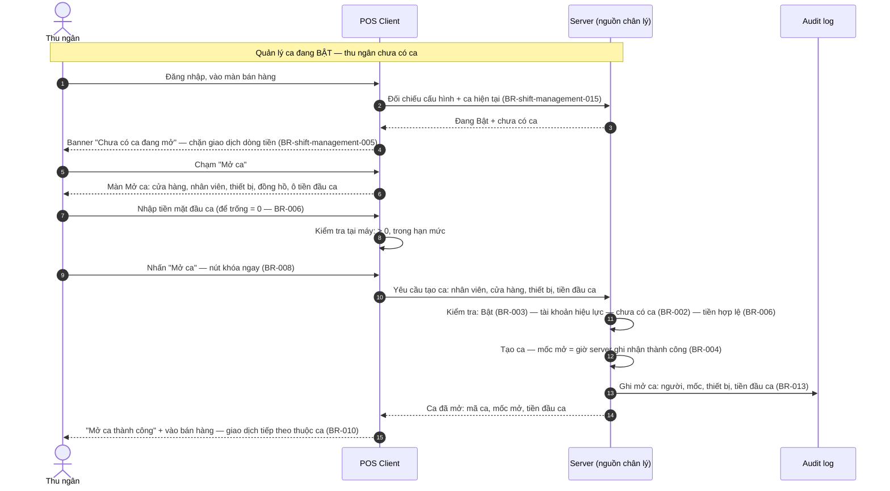
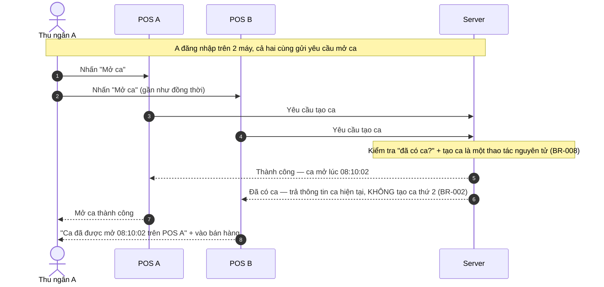
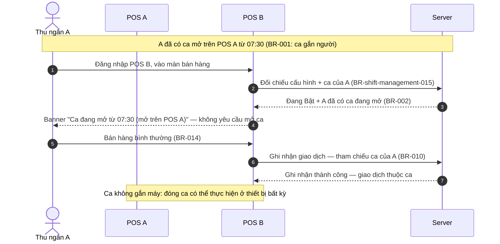
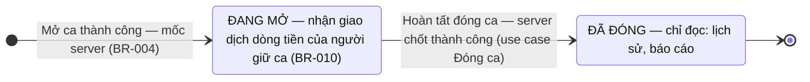
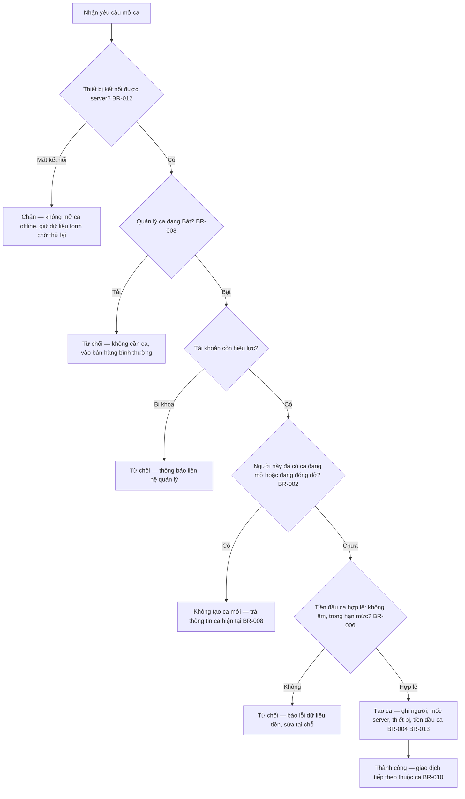

# Sơ đồ tương tác: Mở ca (Open Shift)

> BR-00x trong file này là rule của spec Mở ca (`spec.md`); rule của spec Bật/Tắt dẫn dạng đầy đủ `BR-shift-management-NNN`.

## 1. Sequence Diagram — Mở ca thành công (happy path)

> **Lưu ý:** mở màn hình lúc 08:00 nhưng nhấn Mở ca lúc 08:10 thì mốc mở là **08:10** — lấy tại server lúc tạo thành công, không lấy thời gian mở form (BR-004).

## 2. Sequence Diagram — Chống trùng ca: hai thiết bị gửi gần như đồng thời (Case 4)

## 3. Sequence Diagram — Có ca mở, đăng nhập thiết bị khác (Case 1)

> **Lưu ý tiền mặt vật lý:** tiền thu tại POS B nằm ở ngăn kéo POS B trong khi tiền đầu ca đếm tại POS A — không giới hạn thanh toán (OQ-03); đếm tiền nhiều máy xử lý ở use case Đối soát.

## 4. State Diagram — Vòng đời ca

> **Lưu ý:** không có trạng thái "nháp"/"hủy" — mở ca thất bại (lỗi, timeout, mất kết nối) đồng nghĩa ca **không tồn tại** (BR-011). Quá trình nhập đối soát không làm ca rời trạng thái Đang mở — "đang đóng dở" là trạng thái quy trình trên màn hình, không phải trạng thái dữ liệu (chi tiết use case Đóng ca). Ca đã đóng không được mở lại; muốn làm tiếp thì mở ca mới.

## 5. Flowchart — Quyết định trước khi tạo ca (tại server)

