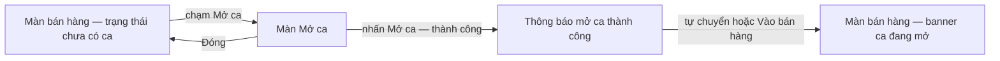

# Đặc tả màn hình: Mở ca (Open Shift)

## 1. Bản đồ màn hình & điều hướng

| Màn | Điều kiện vào | Thoát |
| :--- | :--- | :--- |
| 1. Màn bán hàng — trạng thái "chưa có ca" | Đăng nhập khi Quản lý ca Bật + chưa có ca | Mở ca thành công, hoặc đăng xuất |
| 2. Mở ca | Từ banner hoặc bị chặn ở bước thanh toán | Nhấn Mở ca (thành công), Đóng, hoặc cấu hình chuyển Tắt (màn tự đóng) |
| 3. Thông báo mở ca thành công + banner ca đang mở | Mở ca thành công | Tự chuyển sau 1–2 giây hoặc chạm Vào bán hàng |

## 2. Màn 1 — Trạng thái "chưa có ca" trên màn bán hàng

**Mục đích:** cho nhân viên biết mình chưa có ca và đường vào mở ca, mà không cản việc chuẩn bị đơn.

| Thành phần | Nội dung / Hành vi |
| :--- | :--- |
| Banner trạng thái | "Chưa có ca đang mở — mở ca để thực hiện giao dịch có dòng tiền" + nút **Mở ca** nổi bật |
| Duyệt sản phẩm, tra cứu | Dùng bình thường |
| Tạo giỏ / đơn dở | Dùng bình thường — giỏ giữ nguyên |
| Chạm Thanh toán (giao dịch dòng tiền) | Chặn: "Cần mở ca trước khi thực hiện giao dịch này" + 2 lựa chọn: **Mở ca ngay** / **Để sau** (giữ giỏ) |
| Khi cấu hình Tắt / đã có ca | Banner ẩn |

## 3. Màn 2 — Mở ca

**Mục đích:** xác nhận bắt đầu ca, nhập tiền mặt đầu ca, thực hiện mở ca.

**Thông tin ca (chỉ đọc):**

| Trường | Nội dung |
| :--- | :--- |
| Cửa hàng | Tên cửa hàng hiện tại |
| Nhân viên | Tên + vai trò người đăng nhập |
| Thiết bị | Tên thiết bị đang dùng (ghi nhận nơi mở ca — BR-001) |
| Thời gian hiện tại | Đồng hồ chạy thời gian thực — chỉ tham khảo, mốc lấy tại server (BR-004) |
| Ca trước (nếu có) | "Ca trước của bạn: kết thúc 17:45 hôm qua — tiền cuối ca 500.000" — chỉ tham khảo, không tự điền (Mục 5.1 spec) |

**Trường nhập:**

| Trường | Quy tắc |
| :--- | :--- |
| Tiền mặt đầu ca | Bàn phím số; mặc định **trống** (placeholder "Để trống = 0"); cho nhập 0; không âm; không vượt hạn mức (BR-006); kiểm tra ngay khi nhập |

**Nút:**

| Nút | Hành vi |
| :--- | :--- |
| **Mở ca** (chính) | Khóa ngay khi bắt đầu gửi, đổi nhãn "Đang mở ca..." (BR-008); thành công sang Màn 3; lỗi hiển thị banner lỗi theo Mục 9 spec |
| **Đóng** | Quay lại màn bán hàng (trạng thái chưa có ca giữ nguyên) |
| **Đăng xuất** | Theo luồng đăng xuất chung |

**Trạng thái màn:**

| Trạng thái | Hành vi |
| :--- | :--- |
| Đang gửi | Nút Mở ca khóa; không sửa ô tiền |
| Lỗi dữ liệu tiền | Báo đỏ dưới ô nhập, không gửi |
| Lỗi server / mất kết nối | Banner lỗi + nút **Thử lại**; dữ liệu đã nhập giữ nguyên (Mục 9 spec case 4–6) |
| Cấu hình chuyển Tắt khi đang mở màn | Màn tự đóng về bán hàng thường — không cần ca nữa (Mục 9 spec case 8) |

## 4. Màn 3 — Mở ca thành công & banner ca đang mở

**Thông báo thành công (hiện 1–2 giây hoặc chạm để vào):**

| Thành phần | Nội dung |
| :--- | :--- |
| Xác nhận | "Mở ca thành công" |
| Tóm tắt ca | "Ca #23 · mở 08:10" (số tự tăng theo cửa hàng) — tiền đầu ca |
| Nút | **Vào bán hàng** |

**Banner ca đang mở (thường trực trên màn bán hàng, thu gọn được):**

| Thành phần | Nội dung |
| :--- | :--- |
| Nhãn | "Ca đang mở — {tên nhân viên} — từ {giờ mở}" |
| Điểm truy cập | Xem thông tin ca; Đóng ca (thuộc use case Đóng ca) |
| Ẩn khi | Cấu hình Tắt, hoặc chưa có ca (thay bằng banner Màn 1) |
