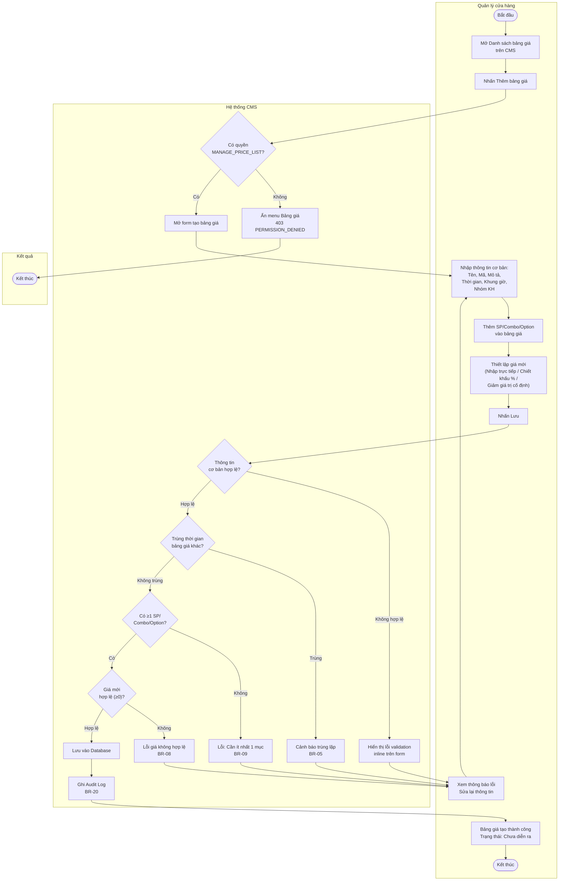
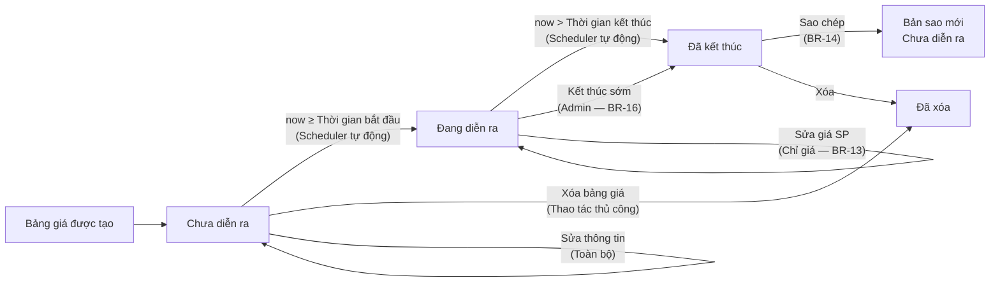
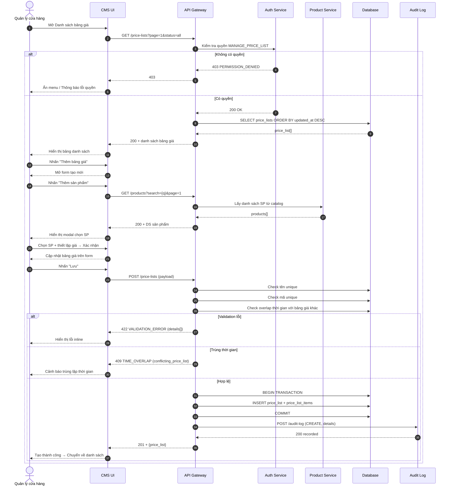

## Flow: price-list-main-flow (Activity Diagram)

> Luồng nghiệp vụ tổng thể tạo và quản lý bảng giá từ góc nhìn các vai trò tham gia (Swimlane).

---

## Flow: price-list-lifecycle (Activity Diagram)

> Luồng vòng đời bảng giá — trạng thái tự động theo thời gian.

---

## Flow: price-list-system-sequence (Sequence Diagram)

> Tương tác chi tiết giữa các thành phần hệ thống theo thứ tự thời gian khi tạo bảng giá.

