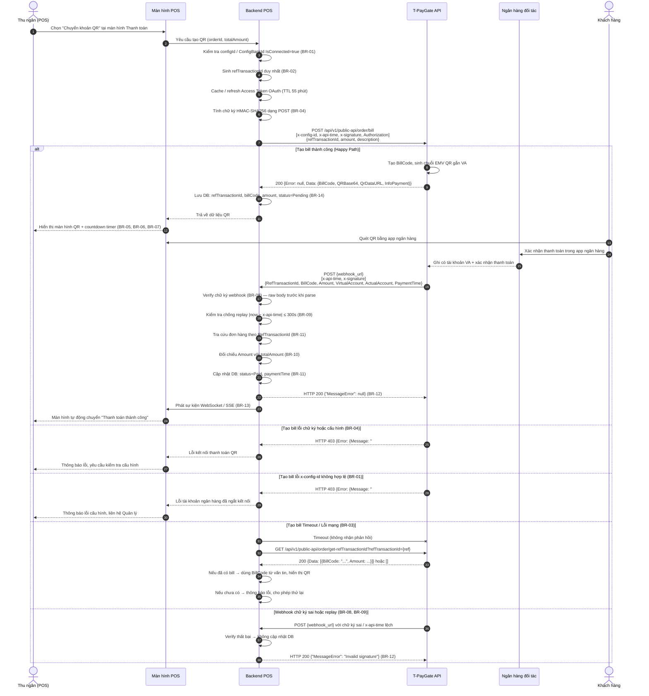
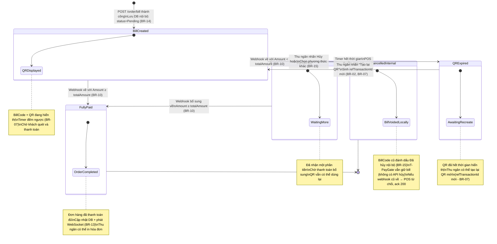
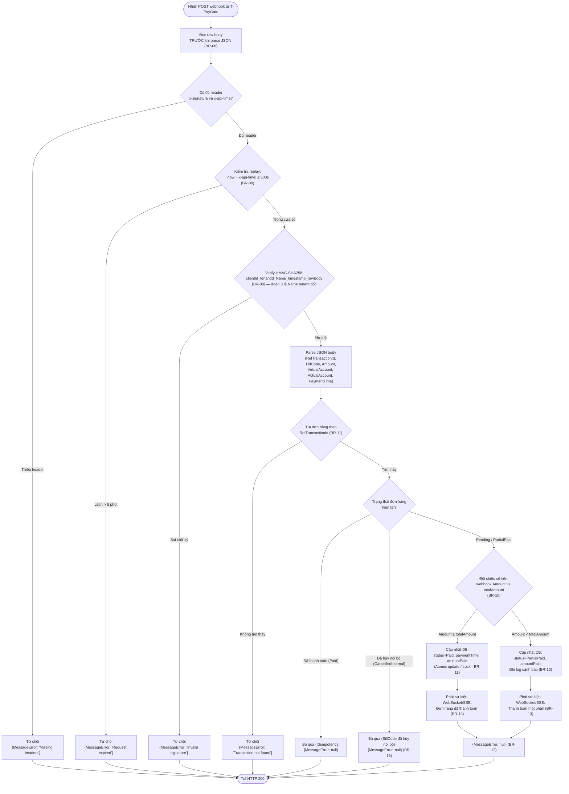

## Flow: qr-payment-activity (Activity Diagram)

> Luồng nghiệp vụ Thanh toán đơn hàng qua mã QR ngân hàng — mô tả trình tự kiểm tra cấu hình ngân hàng, sinh bill QR qua T-PayGate, hiển thị mã QR cho khách, và xử lý webhook xác nhận thanh toán.

```mermaid
flowchart TB
    subgraph CashierLane ["Thu ngân (POS)"]
        Start([Bắt đầu]) --> SelectQR["Chọn phương thức 'Chuyển khoản QR'"]
        SelectQR --> CheckConfig{"Có configId hoặc\nConfigBankId IsConnected=true?\n(BR-01)"}
        CheckConfig -- "Không có cấu hình" --> ShowNoConfig["Hiển thị thông báo:\nChưa cấu hình tài khoản ngân hàng\nDisable phương thức QR (BR-01)"]
        ShowNoConfig --> End0([Kết thúc])
        CheckConfig -- "Hợp lệ" --> GenRefId["Sinh refTransactionId duy nhất:\n{storeCode}-{orderId}-{timestamp} (BR-02)"]
        GenRefId --> SignHMAC["Tính chữ ký HMAC-SHA256 dạng POST:\nclientId_tenantId_source_timestamp_rawBody (BR-04)"]
        SignHMAC --> CallBill["POST /api/v1/public-api/order/bill\n{refTransactionId, amount, description}"]
        CallBill --> BillResult{"Kết quả tạo bill?"}

        BillResult -- "Timeout / Lỗi mạng" --> CheckBillExist["GET /order/get-refTransactionId\nKiểm tra bill đã tạo chưa? (BR-03)"]
        CheckBillExist --> BillFound{"Bill đã tạo\ntrên T-PayGate?"}
        BillFound -- "Đã tạo" --> UseBillCode["Dùng BillCode từ vấn tin\nHiển thị màn hình QR"]
        BillFound -- "Chưa tạo" --> ShowNetError["Hiển thị lỗi kết nối\nCho phép thử lại (refTransactionId mới)"]
        ShowNetError --> End1([Kết thúc])

        BillResult -- "HTTP 403 (Chữ ký / Cấu hình)" --> ShowSigError["Hiển thị lỗi:\nLỗi kết nối thanh toán QR\nYêu cầu Quản lý kiểm tra (BR-04)"]
        ShowSigError --> End2([Kết thúc])

        BillResult -- "HTTP 200 (Error==null)" --> SaveBill["Lưu DB nội bộ:\nrefTransactionId, billCode, amount, configBankId\nstatus=Pending (BR-14)"]
        UseBillCode --> SaveBill
        SaveBill --> RenderQR{"QrDataURL có giá trị?\n(BR-05)"}
        RenderQR -- "Có" --> ShowQRFromURL["Hiển thị ảnh QR từ QrDataURL\n+ Thông tin InfoPayment (BR-06)"]
        RenderQR -- "Không" --> ShowQRFromEMV["Render QR từ chuỗi EMV QRBase64\n+ Thông tin InfoPayment (BR-06)"]
        ShowQRFromURL --> WaitPayment["Màn hình QR đang chờ thanh toán\nTimer đếm ngược (BR-07)"]
        ShowQRFromEMV --> WaitPayment

        WaitPayment --> QREvent{"Sự kiện xảy ra?"}
        QREvent -- "Timer hết hạn" --> ShowExpired["Ẩn QR, hiển thị nút\n'Tạo lại mã QR' (BR-07)"]
        ShowExpired --> End3([Kết thúc — Thu ngân tạo lại hoặc hủy])
        QREvent -- "Thu ngân nhấn Hủy" --> CancelQR["Đánh dấu BillCode cũ là\n'Đã hủy nội bộ' (BR-15)"]
        CancelQR --> End4([Đơn hàng về trạng thái chờ phương thức])
        QREvent -- "Webhook thanh toán về" --> WebhookFlow["Xử lý Webhook (BR-08 → BR-13)"]
        WebhookFlow --> PaymentResult{"Kết quả xử lý\nwebhook?"}
        PaymentResult -- "Đã thanh toán đủ" --> ShowSuccess["Màn hình Thanh toán thành công\nCập nhật đơn hàng (BR-10, BR-13)"]
        PaymentResult -- "Thanh toán một phần" --> ShowPartial["Hiển thị trạng thái:\nThanh toán một phần\n+ Số tiền còn thiếu (BR-10)"]
        ShowSuccess --> End5([Kết thúc — Thu ngân in hóa đơn])
        ShowPartial --> WaitPayment
    end
```

---

## Flow: qr-payment-sequence (Sequence Diagram)

> Tương tác chi tiết giữa các thành phần hệ thống theo trình tự thời gian cho luồng Thanh toán QR — bao gồm cả chiều tạo bill và chiều nhận webhook.

---

## Flow: qr-payment-lifecycle (State Transition Diagram)

> Sơ đồ chuyển đổi trạng thái vòng đời của một Bill QR (`BillCode`) trong hệ thống POS — từ khi tạo đến khi thanh toán hoàn tất hoặc bị hủy nội bộ.

---

## Flow: qr-payment-webhook (Webhook Processing Detail)

> Luồng xử lý chi tiết khi nhận webhook thanh toán từ T-PayGate — tập trung vào bảo mật, idempotency và đối chiếu nghiệp vụ.

