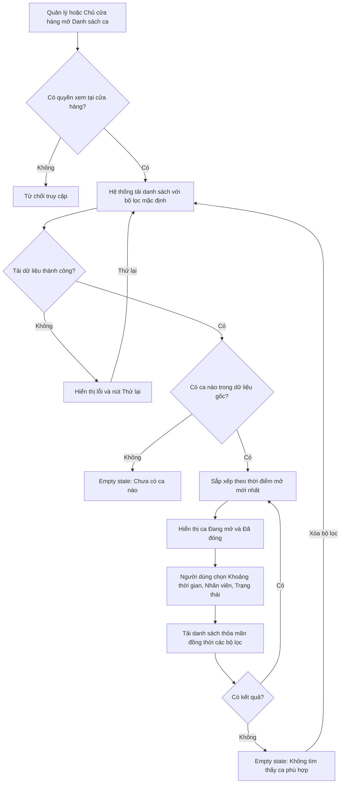
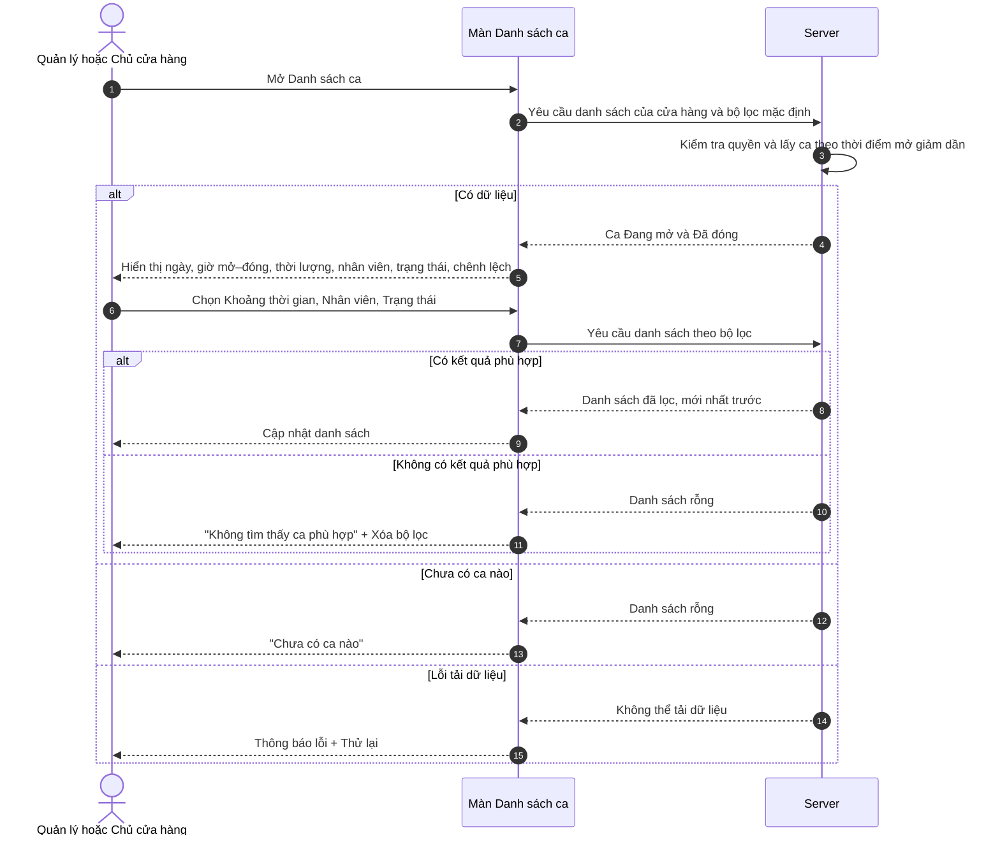

# Use case - Xem danh sách ca

## 1. Lịch sử

| Phiên bản | Ngày cập nhật | Người cập nhật | Nội dung thay đổi |
| :--- | :--- | :--- | :--- |
| 1.1.1 | 10/09/2026 | BA Team | Chốt bộ lọc Khoảng thời gian mặc định là Tất cả thời gian. |
| 1.1.0 | 10/09/2026 | BA Team | Chốt quy tắc ca qua ngày, hiển thị chênh lệch, phân quyền truy cập; chuyển Thông tin nghiệp vụ sang dạng bảng. |
| 1.0.1 | 10/09/2026 | BA Team | Bổ sung trường Mã ca và quy tắc tải danh sách theo từng phần (Mục 6.1). |
| 1.0.0 | 10/09/2026 | BA Team | Khởi tạo SRS use case Xem danh sách ca. |

## 2. User Story

| ID | User Story |
| :--- | :--- |
| US-SHIFT-LIST-01 | Là Quản lý hoặc Chủ cửa hàng, tôi muốn xem danh sách các ca của cửa hàng để theo dõi ca đang hoạt động và tra cứu lịch sử ca đã đóng. |
| US-SHIFT-LIST-02 | Là Quản lý hoặc Chủ cửa hàng, tôi muốn lọc danh sách theo khoảng thời gian, nhân viên và trạng thái để tìm đúng ca cần theo dõi. |

## 3. Thông tin nghiệp vụ

<table class="business-info-table">
    <thead>
        <tr>
            <th>Thông tin nghiệp vụ</th>
            <th>Chi tiết đặc tả</th>
        </tr>
    </thead>
    <tbody>
        <tr>
            <td><strong>1. Mục đích &amp; Phạm vi</strong></td>
            <td>
                
Cho phép <strong>Quản lý cửa hàng</strong> hoặc <strong>Chủ cửa hàng</strong> xem danh sách ca thuộc cửa hàng hiện tại, gồm cả ca <strong>Đang mở</strong> và <strong>Đã đóng</strong>, nhằm theo dõi ca đang hoạt động và tra cứu lịch sử ca.

                
Mỗi ca hiển thị tối thiểu: Mã ca, ngày mở ca, giờ mở–đóng, thời lượng, nhân viên quản lý ca, trạng thái và Chênh lệch. Ca Đã đóng hiển thị số Chênh lệch kèm nhãn Khớp/Thừa/Thiếu; ca Đang mở hiển thị <strong>“Chưa chốt”</strong>.

                
Danh sách được sắp xếp theo thời điểm mở mới nhất trước và hỗ trợ lọc theo <strong>Khoảng thời gian, Nhân viên, Trạng thái</strong>.

                
<strong>Trong phạm vi:</strong> tải danh sách theo từng phần; hiển thị và lọc danh sách; xử lý loading, empty state và lỗi tải; xem lịch sử ca khi Quản lý ca đang Tắt.

                
<strong>Ngoài phạm vi:</strong> xem chi tiết ca; Mở ca, Đóng ca hoặc Đóng ca hộ; đối soát hoặc sửa số liệu; xuất/in báo cáo; mọi nghiệp vụ offline.

            </td>
        </tr>
        <tr>
            <td><strong>2. Actors</strong></td>
            <td>
                
<strong>Chính:</strong> Quản lý cửa hàng và Chủ cửa hàng — được xem toàn bộ danh sách ca của cửa hàng hiện tại.

                
<strong>Không có quyền:</strong> Thu ngân, Nhân viên bán hàng và các vai trò nhân viên thông thường không được truy cập chức năng Danh sách ca.

                
<strong>Hệ thống:</strong> POS/CMS Client hiển thị danh sách và bộ lọc; Server là nguồn dữ liệu chính thức về ca, trạng thái và quyền truy cập.

            </td>
        </tr>
        <tr>
            <td><strong>3. Pre-conditions</strong></td>
            <td>
                <ul>
                    <li>Người dùng đã đăng nhập và đang làm việc trong ngữ cảnh một cửa hàng.</li>
                    <li>Người dùng có vai trò Quản lý cửa hàng hoặc Chủ cửa hàng tại cửa hàng hiện tại.</li>
                    <li>Thiết bị kết nối được server; use case không hỗ trợ dữ liệu danh sách offline.</li>
                    <li>Trạng thái Bật/Tắt của Quản lý ca không phải điều kiện truy cập lịch sử. Khi Tắt, dữ liệu ca cũ vẫn được xem ở chế độ chỉ đọc.</li>
                </ul>
            </td>
        </tr>
        <tr>
            <td><strong>4. Happy Path</strong></td>
            <td>
                <ol>
                    <li>Quản lý hoặc Chủ cửa hàng mở chức năng <strong>Danh sách ca</strong>.</li>
                    <li>Hệ thống kiểm tra quyền và tải danh sách ca của cửa hàng với bộ lọc mặc định.</li>
                    <li>Hệ thống trả về cả ca <strong>Đang mở</strong> và <strong>Đã đóng</strong>, sắp xếp giảm dần theo thời điểm mở.</li>
                    <li>Mỗi dòng/thẻ hiển thị Mã ca, ngày mở, giờ mở–đóng, thời lượng, nhân viên quản lý ca, trạng thái và Chênh lệch/“Chưa chốt”.</li>
                    <li>Người dùng thay đổi Khoảng thời gian, Nhân viên hoặc Trạng thái.</li>
                    <li>Hệ thống hiển thị các ca thỏa mãn đồng thời mọi bộ lọc đang áp dụng.</li>
                    <li>Người dùng xóa bộ lọc; hệ thống khôi phục điều kiện mặc định và tải lại danh sách.</li>
                </ol>
            </td>
        </tr>
        <tr>
            <td><strong>5. Alternative Flow</strong></td>
            <td>
                
<strong>AF-01 — Chưa có ca:</strong> hiển thị <strong>“Chưa có ca nào”</strong> và mô tả <strong>“Các ca phát sinh tại cửa hàng sẽ hiển thị tại đây.”</strong> Không gợi ý Mở ca khi Quản lý ca đang Tắt.

                
<strong>AF-02 — Không có kết quả lọc:</strong> hiển thị <strong>“Không tìm thấy ca phù hợp”</strong>, hướng dẫn thay đổi bộ lọc và hành động <strong>Xóa bộ lọc</strong>.

                
<strong>AF-03 — Quản lý ca đang Tắt:</strong> vẫn cho phép xem toàn bộ lịch sử ca ở chế độ chỉ đọc; không cung cấp thao tác Mở ca hoặc Đóng ca.

                
<strong>AF-04 — Ca Đang mở:</strong> giờ đóng hiển thị “—”; thời lượng tính đến hiện tại; Chênh lệch hiển thị <strong>“Chưa chốt”</strong>, không hiển thị 0.

                
<strong>AF-05 — Ca kéo dài qua ngày:</strong> ca chỉ xuất hiện một lần và thuộc nhóm <strong>ngày mở ca</strong>. Khi lọc, ca vẫn xuất hiện nếu khoảng tồn tại của ca giao với khoảng thời gian được chọn.

                
<strong>AF-06 — Xóa bộ lọc:</strong> xóa đồng thời Khoảng thời gian, Nhân viên và Trạng thái, sau đó tải lại dữ liệu mặc định.

            </td>
        </tr>
        <tr>
            <td><strong>6. Lỗi và edge cases</strong></td>
            <td>
                
<strong>E-01 — Không có quyền:</strong> từ chối truy cập và không trả dữ liệu ca.

                
<strong>E-02 — Không tải được dữ liệu:</strong> giữ bộ lọc đã chọn, hiển thị <strong>“Không thể tải danh sách ca. Vui lòng thử lại.”</strong> và nút <strong>Thử lại</strong>.

                
<strong>E-03 — Khoảng thời gian không hợp lệ:</strong> không áp dụng bộ lọc; báo lỗi tại ngày kết thúc.

                
<strong>E-04 — Nhân viên đã ngừng làm việc:</strong> ca lịch sử vẫn hiển thị tên được lưu tại ca.

                
<strong>E-05 — Ca vừa được đóng:</strong> lần tải lại tiếp theo cập nhật dòng hiện có sang Đã đóng, bổ sung giờ đóng, thời lượng và Chênh lệch đã chốt; không tạo dòng mới.

                
<strong>E-06 — Thiếu dữ liệu thời gian:</strong> không tự suy đoán; hiển thị “—” tại trường thiếu và ghi nhận lỗi dữ liệu để xử lý vận hành.

            </td>
        </tr>
        <tr>
            <td><strong>7. Quy ước ca qua ngày và lọc thời gian</strong></td>
            <td>
                
Danh sách nhóm ca theo <strong>ngày mở ca</strong>, không theo ngày đóng. Một ca kéo dài qua ngày không bị tách thành nhiều dòng.

                
Bộ lọc Khoảng thời gian dùng nguyên tắc <strong>giao khoảng</strong>: ca được hiển thị nếu khoảng tồn tại từ lúc mở đến lúc đóng có giao với khoảng được chọn. Với ca Đang mở, điểm cuối khoảng tồn tại là thời điểm hiện tại.

            </td>
        </tr>
        <tr>
            <td><strong>8. Chỉ số tiền trên danh sách</strong></td>
            <td>
                
Hiển thị duy nhất chỉ số <strong>Chênh lệch = Tiền mặt cuối ca − Tiền mặt kỳ vọng</strong>.

                
Ca <strong>Đã đóng:</strong> hiển thị số tiền với label <strong>Chênh lệch</strong> và nhãn <strong>Khớp / Thừa / Thiếu</strong>.

                
Ca <strong>Đang mở:</strong> hiển thị <strong>“Chưa chốt”</strong>, không hiển thị 0.

                
Không hiển thị Doanh thu ca hoặc Tiền cuối ca trên danh sách; không hiển thị bất kỳ số tiền nào thiếu label.

            </td>
        </tr>
    </tbody>
</table>

## 4. Business Rules

| # | Quy tắc | Mô tả |
| :--- | :--- | :--- |
| BR-001 | Phạm vi dữ liệu và quyền xem | Chỉ Quản lý cửa hàng và Chủ cửa hàng được truy cập; hiển thị toàn bộ ca thuộc cửa hàng hiện tại. Vai trò nhân viên thông thường bị từ chối truy cập và không được trả dữ liệu ca. |
| BR-002 | Hai trạng thái ca | Trạng thái ca trên danh sách chỉ gồm **Đang mở** và **Đã đóng**; không dùng Nháp, Hủy hoặc Đang đóng dở. Quá trình đối soát chưa hoàn tất vẫn là Đang mở. |
| BR-003 | Hiển thị cả ca mở và ca đóng | Khi bộ lọc Trạng thái ở giá trị Tất cả, danh sách phải gồm cả ca Đang mở và Đã đóng. |
| BR-004 | Thứ tự danh sách | Sắp xếp giảm dần theo thời điểm mở do server ghi nhận; ca có thời điểm mở mới nhất hiển thị trước. |
| BR-005 | Ca qua ngày | Một ca kéo dài qua ngày mới vẫn là một ca và chỉ xuất hiện một lần. Ca thuộc nhóm **ngày mở ca**, không nhóm theo ngày đóng. Khi lọc theo Khoảng thời gian, ca thỏa mãn nếu **khoảng tồn tại của ca giao với khoảng được chọn** — ca mở trước khoảng và kết thúc trong hoặc sau khoảng vẫn xuất hiện. |
| BR-006 | Giờ mở và giờ đóng | Giờ mở lấy từ mốc server khi mở ca thành công. Giờ đóng lấy từ mốc server khi đóng ca thành công. Ca Đang mở chưa có giờ đóng. |
| BR-007 | Thời lượng | Ca Đã đóng: thời lượng bằng thời điểm đóng trừ thời điểm mở. Ca Đang mở: thời lượng bằng thời điểm hiện tại trừ thời điểm mở và tiếp tục tăng khi màn hình được cập nhật. |
| BR-008 | Nhân viên quản lý ca | Hiển thị người mở/người giữ ca. Việc quản lý đóng ca hộ không làm thay đổi nhân viên quản lý ca. |
| BR-009 | Kết hợp và mặc định bộ lọc | Khoảng thời gian mặc định là **Tất cả thời gian**. Khoảng thời gian, Nhân viên và Trạng thái được kết hợp theo điều kiện đồng thời; một ca chỉ hiển thị khi thỏa mãn tất cả bộ lọc đang áp dụng. Xóa bộ lọc khôi phục Khoảng thời gian về Tất cả thời gian. |
| BR-010 | Lịch sử khi Quản lý ca Tắt | Tắt Quản lý ca không xóa, ẩn hoặc sửa dữ liệu ca đã phát sinh. Người có quyền vẫn xem được danh sách lịch sử ở chế độ chỉ đọc. |
| BR-011 | Empty state | Phải phân biệt dữ liệu gốc chưa có ca với trường hợp có dữ liệu nhưng không có ca phù hợp bộ lọc; wording và hành động tương ứng không được dùng chung. |
| BR-012 | Chênh lệch trên danh sách | Ca Đã đóng hiển thị **Chênh lệch = Tiền mặt cuối ca − Tiền mặt kỳ vọng**, kèm nhãn Khớp/Thừa/Thiếu. Ca Đang mở hiển thị **“Chưa chốt”**, không hiển thị 0. Không hiển thị Doanh thu ca, Tiền cuối ca hoặc số tiền thiếu label. |
| BR-013 | Dữ liệu ca đã đóng | Ca Đã đóng hiển thị dữ liệu đã chốt và chỉ đọc; không được mở lại hoặc sửa từ màn danh sách. |
| BR-014 | Không hỗ trợ offline | Không tạo bản sao danh sách, bổ sung ca cục bộ hoặc đồng bộ hồi tố trong use case này. Khi không kết nối được server, hiển thị lỗi tải dữ liệu và cho phép thử lại. |
| BR-015 | Nhân viên ngừng hoạt động | Thay đổi trạng thái làm việc của nhân viên không làm mất các ca lịch sử do nhân viên đó quản lý. |

## 5. Sơ đồ tương tác

### Flowchart

### Sequence Diagram

## 6. Mô tả giao diện và trường dữ liệu

### 6.1 Màn hình Danh sách ca

| Tên trường thông tin | Control Type | Bắt buộc | Mặc định | Rules & Lỗi |
| :--- | :--- | :---: | :--- | :--- |
| Tiêu đề | Text - Readonly | Có | Danh sách ca | Hiển thị tên chức năng. Khi Quản lý ca Tắt, hiển thị thông tin chỉ đọc **"Quản lý ca đang tắt — bạn vẫn có thể xem lịch sử ca."** |
| Khoảng thời gian | Date range picker | Không | Tất cả thời gian | Mặc định không giới hạn thời gian; người dùng chủ động chọn ngày bắt đầu và ngày kết thúc khi cần lọc. |
|  |  |  |  | Ngày kết thúc không được trước ngày bắt đầu. |
|  |  |  |  | *Lỗi:* "Ngày kết thúc phải bằng hoặc sau ngày bắt đầu." |
|  |  |  |  | Ca thỏa mãn khi **khoảng tồn tại của ca giao với khoảng được chọn** (BR-005). |
| Nhân viên | Searchable dropdown / Multi-select | Không | Tất cả nhân viên | Danh sách lựa chọn thuộc cửa hàng hiện tại; phải cho phép tìm theo tên hoặc mã nhân viên. Nhân viên đã ngừng hoạt động vẫn được nhận diện trên dữ liệu lịch sử. |
| Trạng thái | Dropdown / Segmented control | Không | Tất cả | Các lựa chọn: **Tất cả**, **Đang mở**, **Đã đóng** (BR-002, BR-003). |
| Xóa bộ lọc | Button | Không | Ẩn hoặc vô hiệu khi chưa thay đổi bộ lọc | Xóa cùng lúc Khoảng thời gian, Nhân viên và Trạng thái; đưa Khoảng thời gian về **Tất cả thời gian**, sau đó tải lại dữ liệu theo từng phần. |
| Mã ca | Text - Readonly | Có | Theo số thứ tự ca tại cửa hàng | Định danh thân thiện dạng "Ca #23" — số thứ tự tự tăng theo cửa hàng (đối chiếu spec Mở ca, Mục 10.1); giúp phân biệt nhiều ca của cùng nhân viên trong một ngày. |
| Ngày | Date - Readonly | Có | Ngày mở ca | Định dạng ngày theo chuẩn hiển thị chung của sản phẩm. Ngày đại diện của ca là **ngày mở ca** (BR-005); ca qua ngày không hiển thị dưới ngày đóng. |
| Giờ mở–đóng | Time range - Readonly | Có | Theo dữ liệu ca | Định dạng `{HH:mm} – {HH:mm}`; mốc chưa có hiển thị `—`. Nếu hai mốc khác ngày, bổ sung ngày ở mốc đóng để tránh hiểu sai (BR-006). |
| Thời lượng | Duration - Readonly | Có | Hệ thống tính | Hiển thị theo định dạng thời lượng chung của sản phẩm; ca đang chạy cần có dấu hiệu trực quan không chỉ dựa vào màu sắc (BR-007). |
| Nhân viên quản lý ca | Text - Readonly | Có | Người mở/người giữ ca | Hiển thị tên; kèm mã nhân viên khi cần phân biệt người trùng tên (BR-008). |
| Trạng thái ca | Status tag | Có | Theo trạng thái server | Luôn hiển thị nhãn chữ; màu sắc chỉ hỗ trợ nhận biết (BR-002). |
| Chênh lệch | Currency - Readonly | Có | Theo dữ liệu ca | Chỉ có giá trị trên ca **Đã đóng**: Chênh lệch = Tiền mặt cuối ca − Tiền mặt kỳ vọng, hiển thị kèm nhãn **Khớp/Thừa/Thiếu** (công thức đối chiếu use case Đóng ca). Ca **Đang mở** hiển thị chữ "Chưa chốt", không hiển thị 0 hay số không nhãn (BR-012). Định dạng theo chuẩn tiền tệ chung của sản phẩm. |
| Danh sách ca | List / Table | Có | Sắp xếp mới nhất trước | Có skeleton/loading tại vùng danh sách. Tải dữ liệu theo từng phần (tải thêm khi cuộn hoặc phân trang theo quy ước chung của sản phẩm); không tải toàn bộ lịch sử trong một lần. Quy tắc dữ liệu, sắp xếp và lọc theo BR-001, BR-004, BR-009 và BR-014. |
| Empty state chưa có dữ liệu | Empty state | Điều kiện | Ẩn | Hiển thị khi cửa hàng chưa từng có ca: **"Chưa có ca nào"** và **"Các ca phát sinh tại cửa hàng sẽ hiển thị tại đây."** |
| Empty state sau lọc | Empty state | Điều kiện | Ẩn | Hiển thị khi dữ liệu gốc có ca nhưng không có ca phù hợp: **"Không tìm thấy ca phù hợp"**, hướng dẫn đổi bộ lọc và nút **Xóa bộ lọc**. |
| Lỗi tải dữ liệu | Error state | Điều kiện | Ẩn | Hiển thị **"Không thể tải danh sách ca. Vui lòng thử lại."** và nút **Thử lại**; giữ nguyên các bộ lọc người dùng đã chọn. |

### 6.2 Điều hướng

| Từ màn hình | Hành động | Đến màn hình | Ghi chú |
| :--- | :--- | :--- | :--- |
| Điểm truy cập chức năng ca | Chọn **Danh sách ca** | Màn hình Danh sách ca | Chỉ Quản lý/Chủ cửa hàng; vẫn truy cập được khi Quản lý ca đang Tắt. |
| Màn hình Danh sách ca | Thay đổi bộ lọc | Giữ nguyên màn hình | Tải lại danh sách theo các bộ lọc kết hợp. |
| Empty state sau lọc | Chọn **Xóa bộ lọc** | Màn hình Danh sách ca | Khôi phục bộ lọc mặc định và tải lại dữ liệu. |
| Trạng thái lỗi | Chọn **Thử lại** | Màn hình Danh sách ca | Giữ bộ lọc hiện tại và gửi lại yêu cầu tải dữ liệu. |

> Không đặc tả hành động chọn một ca để mở Chi tiết ca trong use case này. Điều hướng đó chỉ được bổ sung khi use case Xem chi tiết ca được xác định.

### 6.3 Trạng thái hiển thị

| Trạng thái màn hình | Hành vi |
| :--- | :--- |
| Đang tải lần đầu | Hiển thị skeleton cho vùng bộ lọc và danh sách; không hiển thị nhầm empty state trong lúc chờ dữ liệu. |
| Đang áp dụng bộ lọc | Giữ bộ lọc và nội dung hiện tại ở trạng thái không gây nhầm lẫn; hiển thị loading tại vùng danh sách. |
| Có dữ liệu | Hiển thị danh sách mới nhất trước và đầy đủ thông tin tối thiểu của từng ca. |
| Chưa từng có ca | Hiển thị empty state dữ liệu gốc. |
| Không có kết quả lọc | Hiển thị empty state sau lọc và hành động Xóa bộ lọc. |
| Lỗi tải dữ liệu | Hiển thị thông báo lỗi và Thử lại; không thay lỗi bằng empty state. |
| Quản lý ca Tắt | Hiển thị lịch sử ca chỉ đọc; không hiển thị hành động Mở ca/Đóng ca trong phạm vi màn hình này. |
