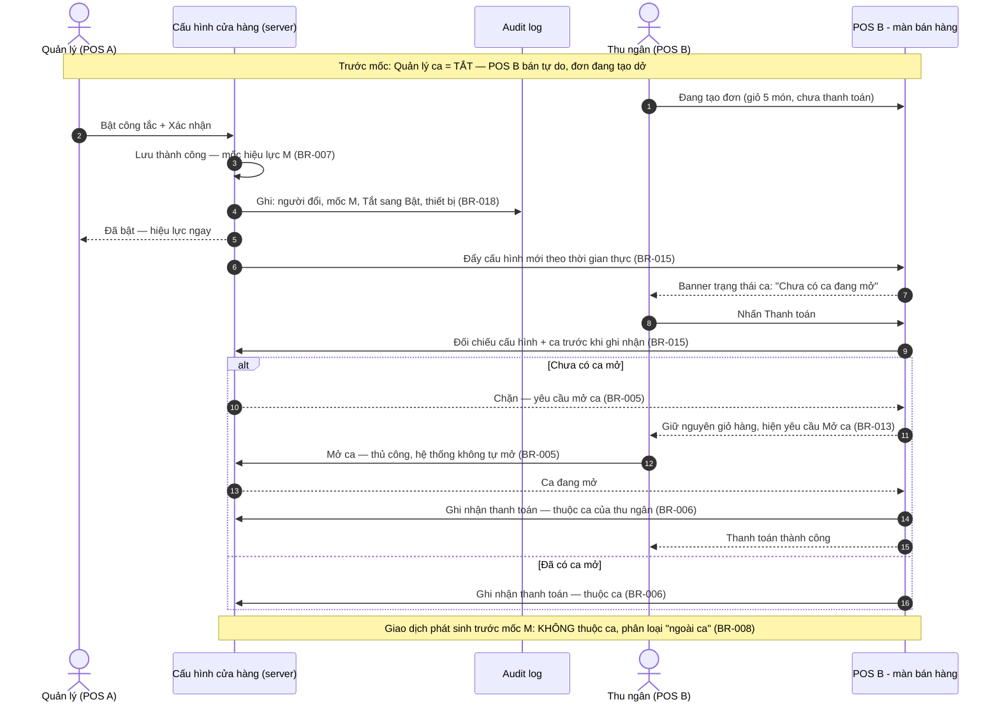
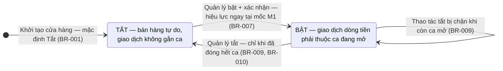
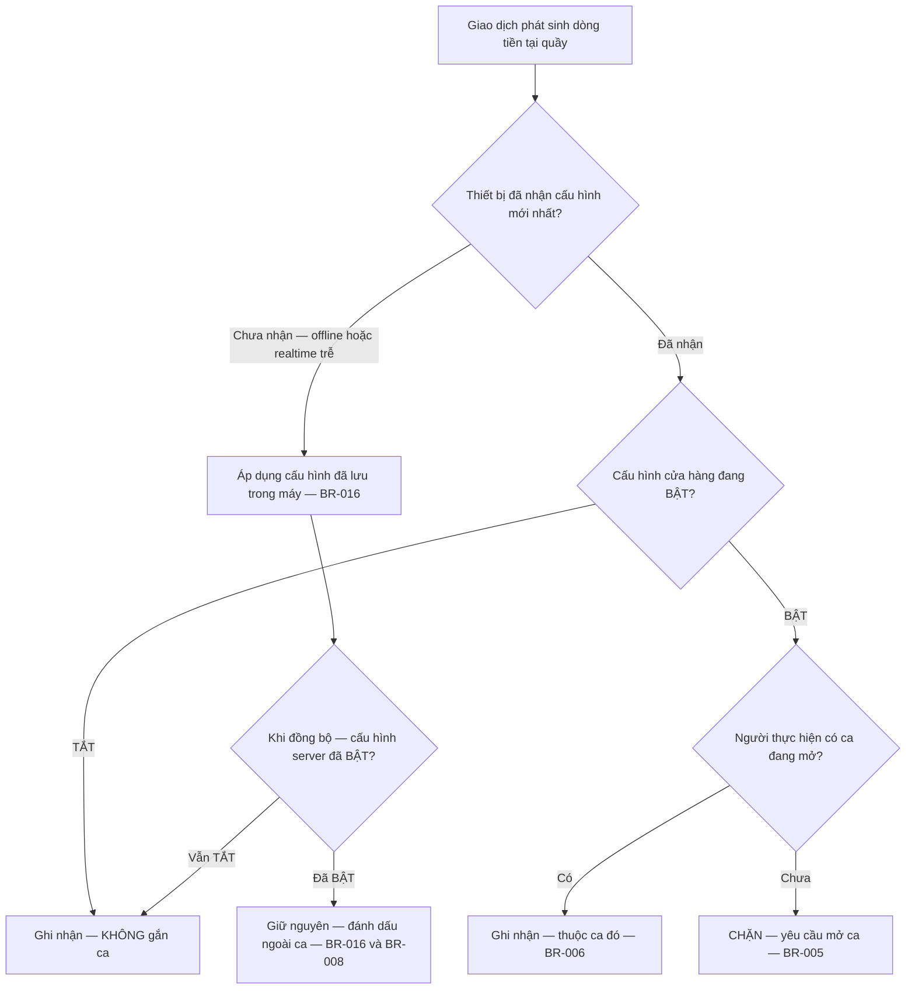

# Sơ đồ tương tác: Shift Management (Bật/Tắt Quản lý ca)

## 1. Sequence Diagram — Bật cấu hình, lan tỏa đa thiết bị (đơn đang tạo dở ở POS B)



> **Lưu ý:** Nếu realtime chưa kịp tới POS B thì bước "Đối chiếu trước khi ghi nhận" vẫn chặn tại server — lớp đối chiếu là bảo đảm cuối, realtime chỉ để trải nghiệm (BR-015).

## 2. Sequence Diagram — Tắt khi còn ca mở: chặn + đóng ca hộ (Hướng 1)

```mermaid
sequenceDiagram
    autonumber
    actor TN as Thu ngân (người giữ ca)
    participant CA as Ca của cửa hàng
    actor QL as Quản lý (POS A)
    participant CFG as Cấu hình cửa hàng (server)

    Note over TN,CFG: Đang BẬT — ca mở từ 07:30, chưa đóng
    TN->>CA: Còn ca đang mở
    QL->>CFG: Tắt công tắc
    CFG->>CA: Kiểm tra số ca đang mở của cửa hàng
    alt Còn từ 1 ca mở (kể cả đang đóng dở)
        CFG-->>QL: CHẶN — "Không thể tắt Quản lý ca khi vẫn còn N ca đang mở" + danh sách ca (BR-009)
        QL->>CA: Đóng ca hộ — bắt buộc ghi lý do (BR-009)
        CA-->>TN: Thông báo "Ca được đóng hộ" kèm lý do
        QL->>CFG: Tắt lại công tắc
        CFG-->>QL: Tắt thành công — mốc M2 (BR-010)
    else Đã đóng hết ca
        CFG-->>QL: Tắt thành công — mốc M2 (BR-010)
    end

    Note over QL,CA: Sau mốc M2: không yêu cầu ca với giao dịch mới; lịch sử ca cũ vẫn xem được (BR-011)
```

> **Lưu ý:** Ca "đang đóng dở" (đang đối soát) vẫn tính là đang mở — phải hoàn tất đóng ca rồi mới tắt được (Edge case 5 trong spec).

## 3. State Diagram — Vòng đời cấu hình Bật/Tắt



> **Phân thuộc giao dịch theo mốc:** trước M1 mọi giao dịch ngoài ca; từ M1 giao dịch dòng tiền phải thuộc ca (BR-006, BR-008). Bật lại sau thời gian tắt bắt đầu hoàn toàn mới, không hồi sinh ca cũ (BR-012). Dữ liệu ca phát sinh ở giai đoạn BẬT trước đó giữ nguyên khi về TẮT (BR-011).

## 4. Flowchart — Quyết định giao dịch có thuộc ca không (tại thời điểm ghi nhận)



> **Lưu ý:** Quyết định thuộc ca hay không lấy trạng thái cấu hình **tại thời điểm server ghi nhận** giao dịch — không phải lúc mở màn hình hay lúc bắt đầu tạo chứng từ (BR-014). Nhánh J không tự gán vào ca đang mở khi đồng bộ — tránh gán hồi tố (BR-008).
