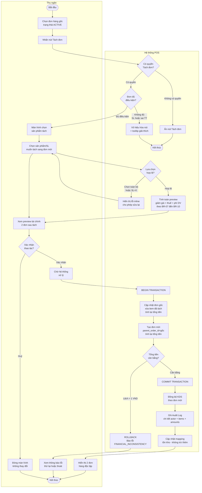
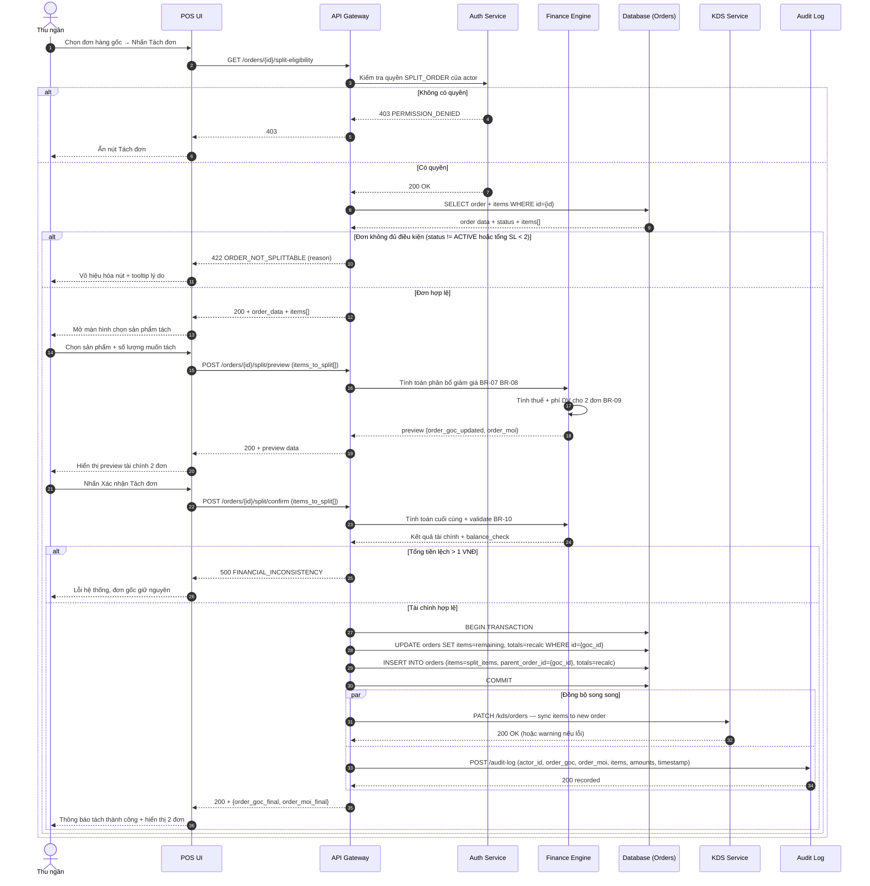
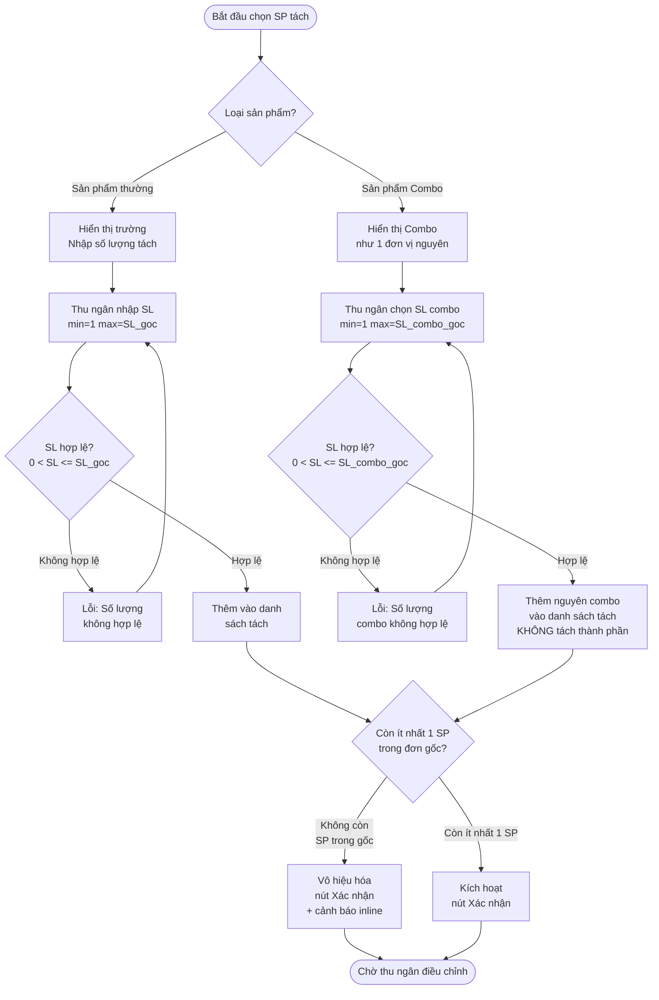

## Flow: split-order-main-flow (Activity Diagram)

> Luồng nghiệp vụ tổng thể từ góc nhìn các vai trò tham gia (Swimlane).

---

## Flow: split-order-system-sequence (Sequence Diagram)

> Tương tác chi tiết giữa các thành phần hệ thống theo thứ tự thời gian.

---

## Flow: split-order-combo-edge-case (Activity Diagram)

> Luồng xử lý riêng cho sản phẩm combo khi thực hiện tách đơn.

