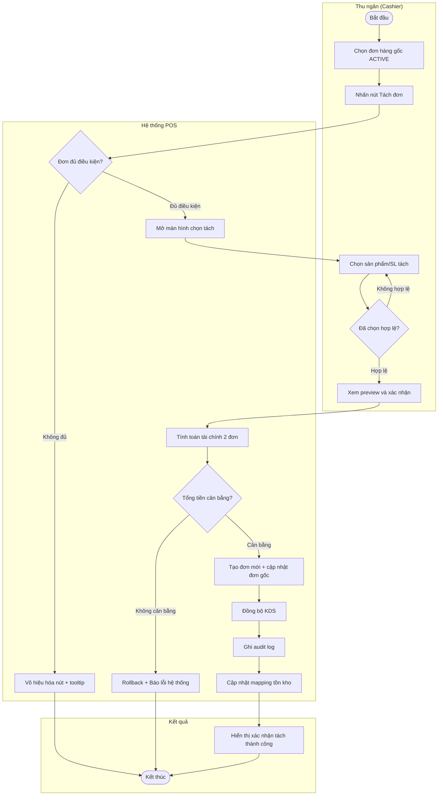
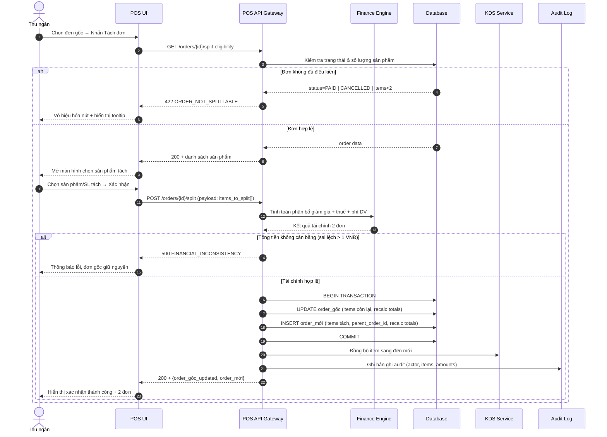

# Đặc tả tính năng: Tách đơn từ đơn hàng gốc (Split Order)

## 1. Tổng quan nghiệp vụ (Business Overview)

| Thông tin nghiệp vụ | Chi tiết đặc tả |
| :--- | :--- |
| **1. Mục đích & Phạm vi** | Cho phép nhân viên thu ngân/quản lý cửa hàng **tách một đơn hàng đang hoạt động thành từ 2 đơn hàng trở lên**, trong đó mỗi đơn con được tính toán độc lập về tổng tiền, giảm giá, thuế và phí dịch vụ. Phạm vi áp dụng: POS F&B (đơn tại bàn, mang đi). Không áp dụng cho đơn đã thanh toán, đơn đã hủy, hoặc đơn đang trong trạng thái giao hàng. |
| **2. Actors (Tác nhân)** | **Chính:** Thu ngân (Cashier), Quản lý cửa hàng (Store Manager). **Hỗ trợ:** Hệ thống POS Backend, Module tính toán tài chính (Finance Engine), Module quản lý tồn kho (Inventory Service), KDS (Kitchen Display System), Nhật ký thao tác (Audit Log). |
| **3. Pre-conditions (Điều kiện tiên quyết)** | 1. Đơn hàng gốc tồn tại và đang ở trạng thái **Đang hoạt động** (`ACTIVE`) — tức là đã tạo nhưng chưa thanh toán, chưa hủy. 2. Đơn hàng gốc phải có **ít nhất 2 dòng sản phẩm** (line items) hoặc ít nhất 1 sản phẩm có số lượng ≥ 2 để có thể tách. 3. Người dùng có **quyền tách đơn** được cấp bởi quản trị viên. 4. Không có khoản thanh toán một phần (partial payment) đang pending trên đơn gốc. |
| **4. Expected Results (Kết quả mong đợi)** | **Happy Path (Luồng xử lý chính):** 1. Thu ngân chọn đơn hàng gốc đang `ACTIVE`. 2. Thu ngân bấm **"Tách đơn"**, hệ thống mở màn hình chia chọn sản phẩm. 3. Thu ngân chọn sản phẩm/số lượng muốn tách sang đơn mới. 4. Hệ thống tính toán và hiển thị preview tài chính cho cả 2 đơn (gốc còn lại + đơn mới). 5. Thu ngân xác nhận → Hệ thống tạo đơn mới, cập nhật đơn gốc, ghi lịch sử, đồng bộ KDS. 6. Hai đơn được thanh toán độc lập.  **Alternate Branches (Luồng rẽ nhánh & Ngoại lệ):** - **[Nhánh A - Đơn chỉ có 1 sản phẩm SL=1]:** Nút "Tách đơn" bị vô hiệu hóa, tooltip giải thích lý do. - **[Nhánh B - Tách sản phẩm combo]:** Toàn bộ combo được tách như một đơn vị, không cho phép tách từng biến thể thành phần bên trong combo. - **[Nhánh C - Chọn toàn bộ sản phẩm]:** Hệ thống cảnh báo "Không thể tách toàn bộ, đơn gốc phải còn ít nhất 1 sản phẩm", không cho phép xác nhận. - **[Ngoại lệ D - Lỗi hệ thống]:** Rollback toàn bộ transaction, đơn gốc giữ nguyên, hiển thị thông báo lỗi kỹ thuật. |

---

## 2. Quy tắc nghiệp vụ cốt lõi (Core Business Rules)

| # | Quy tắc | Mô tả | Xử lý vi phạm |
| :--- | :--- | :--- | :--- |
| **BR-01** | **[Constraint] Điều kiện kích hoạt tách đơn** | Chỉ cho phép tách đơn khi đơn gốc ở trạng thái `ACTIVE` (đã tạo, chưa thanh toán, chưa hủy). Đơn đã thanh toán toàn phần hoặc một phần, đơn đã hủy, đơn đang giao không được tách. | Ẩn/disable nút "Tách đơn". Nếu truy cập trực tiếp qua API: trả về lỗi `HTTP 422 – ORDER_NOT_SPLITTABLE`. |
| **BR-02** | **[Constraint] Số lượng sản phẩm tối thiểu** | Đơn gốc phải có tổng số lượng dòng sản phẩm (sau khi quy đổi) ≥ 2 đơn vị. Ví dụ: 1 sản phẩm SL=1 không đủ điều kiện; 1 sản phẩm SL=2 đủ điều kiện. | Vô hiệu hóa nút "Tách đơn" và hiển thị tooltip: _"Đơn hàng cần có ít nhất 2 sản phẩm để tách."_ |
| **BR-03** | **[Constraint] Đơn gốc phải còn ít nhất 1 sản phẩm** | Khi thu ngân thực hiện chọn sản phẩm để tách, **không được phép chọn toàn bộ sản phẩm** khỏi đơn gốc. Đơn gốc phải còn ít nhất 1 dòng sản phẩm với SL ≥ 1. | Disable nút "Xác nhận tách" và hiển thị cảnh báo inline: _"Đơn gốc phải giữ lại ít nhất 1 sản phẩm."_ |
| **BR-04** | **[Constraint] Phân quyền tách đơn** | Chỉ tài khoản được cấp quyền `SPLIT_ORDER` (do quản trị viên thiết lập) mới có thể thực hiện tách đơn. | Ẩn nút "Tách đơn" khỏi giao diện. Nếu truy cập API trực tiếp: `HTTP 403 – PERMISSION_DENIED`. |
| **BR-05** | **[Constraint] Sản phẩm combo – tách nguyên khối** | Khi tách sản phẩm combo, hệ thống **bắt buộc tách nguyên bộ combo** (ví dụ: Combo Bò Bít Tết gồm bít tết + khoai tây + nước). **Không cho phép** tách lẻ từng biến thể/thành phần bên trong combo sang đơn khác. | Giao diện chỉ cho phép chọn số lượng combo nguyên, không hiển thị các thành phần để chọn riêng. Cảnh báo nếu người dùng cố tình: _"Không thể tách thành phần bên trong combo. Vui lòng chọn toàn bộ combo."_ |
| **BR-06** | **[Constraint] Số lượng tách hợp lệ** | Số lượng sản phẩm được tách sang đơn mới phải thỏa: `0 < SL_tách ≤ SL_gốc`. Không cho phép tách vượt quá số lượng hiện có. | Trường nhập số lượng giới hạn min=1, max=SL_gốc. Hiển thị lỗi inline: _"Số lượng không hợp lệ. Tối đa {SL_gốc}."_ |
| **BR-07** | **[Derivation] Phân bổ giảm giá đơn hàng (Order-level Discount)** | Giảm giá cấp đơn hàng (%) được phân bổ theo tỷ lệ giá trị sản phẩm trên từng đơn sau tách. Công thức: `Giảm_giá_đơn_con = Tổng_giảm_giá_gốc × (Giá_trị_đơn_con / Giá_trị_đơn_gốc)`. Giảm giá cố định (VNĐ): phân bổ theo tỷ lệ tương đương. | Nếu không tính được tỷ lệ (Giá trị đơn gốc = 0): dừng xử lý, báo lỗi hệ thống. |
| **BR-08** | **[Derivation] Giảm giá sản phẩm (Item-level Discount)** | Giảm giá cấp sản phẩm đi theo sản phẩm đó sang đơn mới. Nếu sản phẩm được tách một phần số lượng: giảm giá phân bổ tuyến tính theo số lượng. Công thức: `Giảm_giá_item_con = (Giảm_giá_item_gốc / SL_gốc) × SL_tách`. | Nếu giảm giá item là coupon cố định (áp vào toàn bộ sản phẩm không phân bổ được theo SL): coupon đi theo **đơn gốc**, đơn mới không áp coupon đó. Hiển thị cảnh báo cho thu ngân. |
| **BR-09** | **[Derivation] Tính toán lại tổng tiền sau tách** | Mỗi đơn sau tách được tính lại độc lập theo công thức: `Tạm tính = Σ(Đơn giá × Số lượng)` `Giảm giá sản phẩm = Σ(Giảm giá item đã phân bổ)` `Giảm giá đơn = Giảm giá đơn hàng đã phân bổ (BR-07)` `Thuế = (Tạm tính − Giảm giá SP − Giảm giá đơn) × Thuế suất` `Phí dịch vụ = (Tạm tính − Giảm giá SP − Giảm giá đơn) × % Phí DV` `Cần thanh toán = Tạm tính − Giảm giá SP − Giảm giá đơn + Thuế + Phí DV` | Nếu kết quả âm do cấu hình giảm giá bất thường: hệ thống đặt minimum = 0, ghi cảnh báo vào audit log. |
| **BR-10** | **[Derivation] Bảo toàn tổng tiền** | Tổng `Cần thanh toán` của các đơn con sau tách phải **xấp xỉ** tổng `Cần thanh toán` của đơn gốc (cho phép sai lệch làm tròn ≤ 1 VNĐ do chia số nguyên). Hệ thống phân bổ phần lẻ vào đơn gốc. | Nếu sai lệch > 1 VNĐ: dừng xử lý, báo lỗi `FINANCIAL_INCONSISTENCY` và rollback. |
| **BR-11** | **[State Transition] Trạng thái đơn hàng sau tách** | Sau khi tách thành công: - **Đơn gốc:** Giữ nguyên trạng thái `ACTIVE`, mã đơn gốc không đổi, được cập nhật danh sách sản phẩm còn lại. - **Đơn mới:** Tạo với trạng thái `ACTIVE`, mã đơn mới được sinh tự động, chứa `parent_order_id` trỏ về đơn gốc. | Nếu tạo đơn mới thất bại: rollback toàn bộ, đơn gốc giữ nguyên trạng thái ban đầu. |
| **BR-12** | **[State Transition] Trạng thái KDS sau tách** | Các món đã được KDS đánh dấu `DONE` (đã làm xong) trước khi tách → Giữ nguyên trạng thái `DONE`, đi theo đúng sản phẩm sang đơn tương ứng. Các món đang `IN_PROGRESS` hoặc `PENDING` → Đồng bộ lại KDS theo đơn mới ngay sau khi tách thành công. | Nếu đồng bộ KDS thất bại: tách đơn vẫn thành công (đã commit DB), nhưng ghi cảnh báo vào audit log và thông báo cho quản lý để xử lý thủ công. |
| **BR-13** | **[Action Enabler] Không tách khi có partial payment pending** | Nếu đơn gốc đang có khoản thanh toán một phần đang chờ xử lý (trạng thái `PAYMENT_PENDING`), không cho phép tách. | Hiển thị thông báo: _"Không thể tách đơn khi đang có giao dịch thanh toán đang xử lý. Vui lòng chờ giao dịch hoàn tất."_ |
| **BR-14** | **[Data Validation] Mã đơn mới** | Đơn hàng mới sau tách được sinh mã tự động theo chuẩn hệ thống (ví dụ: `HD-{timestamp}-{random}`). Mã đơn mới phải **unique** trong hệ thống, không trùng mã đơn gốc. Trường `parent_order_id` lưu mã đơn gốc. | Nếu sinh mã trùng: thử lại tối đa 3 lần, sau đó báo lỗi `ORDER_ID_GENERATION_FAILED`. |
| **BR-15** | **[Data Validation] Audit Log** | Mỗi thao tác tách đơn phải ghi vào bảng `order_audit_log` với đầy đủ: `order_id_gốc`, `order_id_mới`, `actor_id`, `actor_role`, `timestamp`, `danh_sách_item_tách`, `giá_trị_trước_tách`, `giá_trị_sau_tách`. | Nếu ghi audit log thất bại: vẫn commit transaction tách đơn nhưng ghi cảnh báo vào system error log và cảnh báo DevOps. |
| **BR-16** | **[Derivation] Cập nhật tồn kho** | Tách đơn **không làm thay đổi tồn kho** (vì sản phẩm đã được trừ tồn kho từ lúc tạo đơn gốc). Hệ thống chỉ cập nhật mapping giữa đơn hàng và sản phẩm, không cộng/trừ thêm tồn kho. | Nếu phát hiện sai lệch tồn kho tại thời điểm tách (ví dụ do race condition): ghi cảnh báo vào audit log, vẫn cho phép tách (không block). |

---

## 3. Sơ đồ tương tác (Interaction Diagram)

*(Các sơ đồ dưới đây được lưu đầy đủ tại `docs/split-order/srs/flows.md`)*

### 3.1 Activity Diagram — Luồng nghiệp vụ tách đơn

### 3.2 Sequence Diagram — Tương tác hệ thống chi tiết

*(Xem đầy đủ tại `flows.md` – Flow: split-order-system-sequence)*

---

## 4. Đặc tả màn hình (Screen Specifications)

*(Đặc tả chi tiết được lưu tại `docs/split-order/srs/screens.md`)*

![[screens.md]]

---

## 5. Phân tích đối thủ cạnh tranh (Competitive Analysis)

### KiotViet — Tính năng "Tách ghép đơn"
- **Có tính năng tách đơn native** trên F&B (nhà hàng, quán cafe).
- Hỗ trợ: Tách món sang đơn mới, tách sang đơn đã có, chọn bàn/phòng đích.
- Phân quyền rõ ràng: admin cấp quyền `Tách đơn` cho từng nhân viên.
- Hỗ trợ đa nền tảng: Web, ứng dụng POS Nhà hàng, ứng dụng Nhân viên mobile.
- **Điểm còn thiếu (cơ hội khác biệt hoá):** Không thể hiện rõ công thức phân bổ giảm giá; không có preview tài chính chi tiết trước khi xác nhận.

### Sapo POS — Workaround (không có native split order)
- **Không có tính năng tách đơn trực tiếp** tại thời điểm khảo sát.
- Giải pháp thay thế: Sao chép đơn hàng → chỉnh sửa thủ công → cập nhật lại đơn gốc (tốn nhiều bước, dễ sai sót).
- Có hỗ trợ **Tách dòng sản phẩm** (tách số lượng trong 1 dòng) nhưng không tách thành 2 đơn độc lập.
- **Cơ hội khác biệt hoá:** Đây là điểm mà Otio có thể vượt trội Sapo bằng tính năng native, tự động hóa tài chính và audit trail đầy đủ.

### Điểm khác biệt của Otio (USP)
| Tiêu chí | KiotViet | Sapo | Otio |
| :--- | :---: | :---: | :---: |
| Native Split Order | ✅ | ❌ | ✅ |
| Preview tài chính trước khi tách | ⚠️ | ❌ | ✅ |
| Phân bổ giảm giá tự động | ⚠️ | ❌ | ✅ |
| Bảo toàn tổng tiền (financial integrity check) | ❓ | ❌ | ✅ |
| Audit log chi tiết | ⚠️ | ❌ | ✅ |
| Đồng bộ KDS sau tách | ✅ | ❌ | ✅ |
| Combo tách nguyên khối | ❓ | ❌ | ✅ |

---

## 6. Open Questions

- [ ] **OQ-01:** Hệ thống có cho phép tách đơn thành **hơn 2 đơn** trong 1 lần thao tác không? (hiện tại spec thiết kế cho 1 lần tách = 2 đơn; muốn tách thêm thì thực hiện lại)
- [ ] **OQ-02:** Khi đơn gốc đang áp **voucher/coupon từ chương trình khuyến mãi** (không phân bổ theo tỷ lệ được) — coupon đi theo đơn gốc hay đơn mới? Hay cần thu ngân chọn?
- [ ] **OQ-03:** Có giới hạn số lần tách tối đa từ 1 đơn gốc không? (ví dụ: tối đa tách 5 lần)
- [ ] **OQ-04:** Sau khi tách, nếu **đơn mới bị hủy**, các sản phẩm có được gộp lại vào đơn gốc không (reverse split)?
- [ ] **OQ-05:** Đơn gốc sau tách có hiển thị **badge/tag "Đã tách"** để phân biệt không?

---

## 7. References

- `@../../rules/approval-gate.md`
- `@../../rules/diagram-selection.md`
- `@../screen/SKILL.md` (Skill Con phụ trách đặc tả màn hình)
- KiotViet Help Center — Tính năng Tách ghép đơn: https://support.kiotviet.vn
- Sapo POS — Quản lý đơn hàng: https://support.sapo.vn
