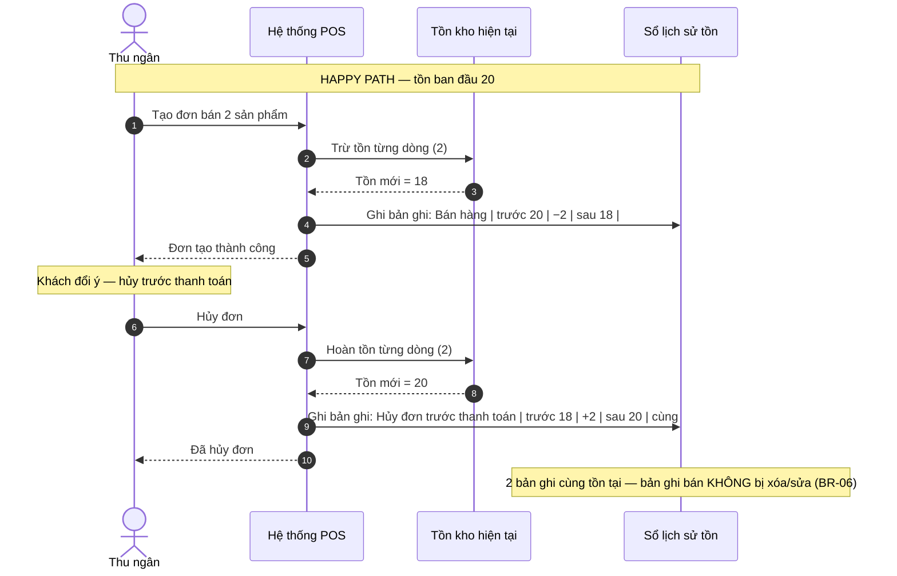
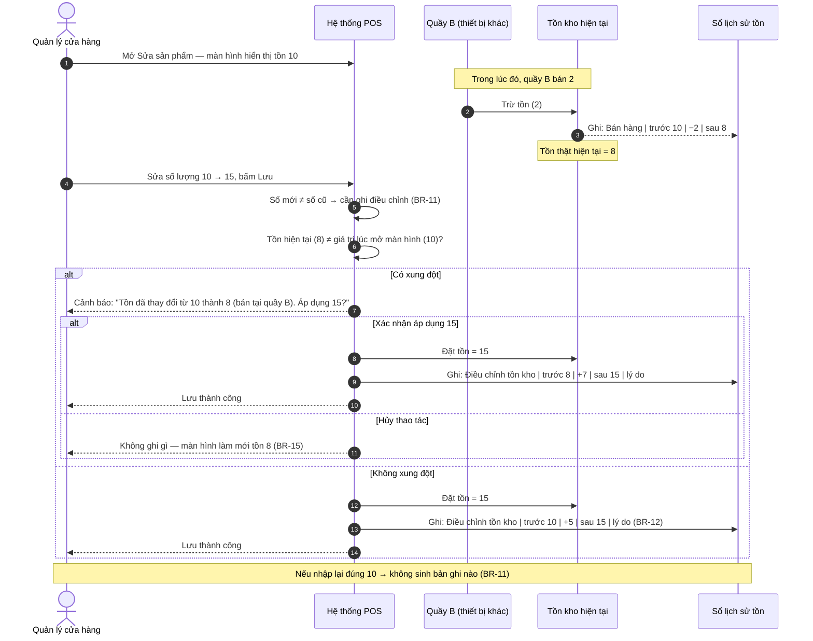
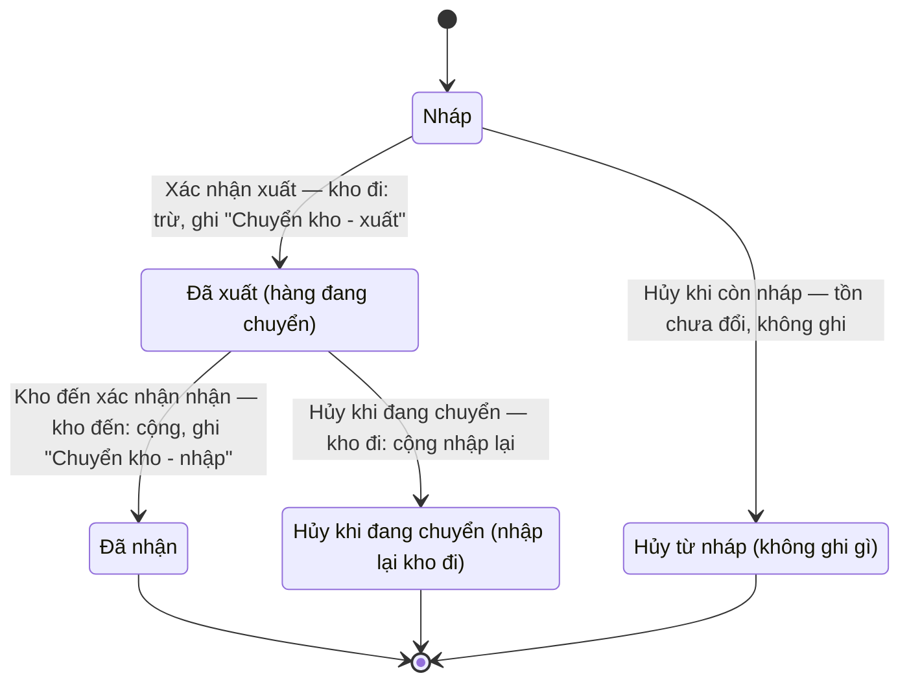

# Sơ đồ tương tác: Stock History (Lịch sử thay đổi tồn kho)

## 1. Sequence Diagram — Bán rồi hủy đơn trước thanh toán (đảo ngược, không xóa)

## 2. Sequence Diagram — Điều chỉnh trực tiếp trên Sửa sản phẩm (kèm xung đột thiết bị khác)

## 3. State Diagram — Vòng đời phiếu chuyển kho & ảnh hưởng tồn hai kho

> **Lưu ý:** Ở trạng thái "Đã xuất", số hàng đang chuyển **không bán được ở cả hai kho** — kho đi đã trừ, kho đến chưa cộng (BR-10). Phiếu chuyển bị hủy sau khi xuất không xóa bản ghi "Chuyển kho — xuất" đã ghi, mà sinh bản ghi cộng nhập lại (BR-06).
