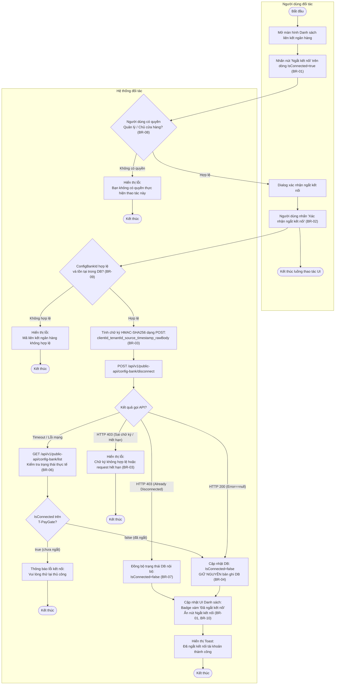
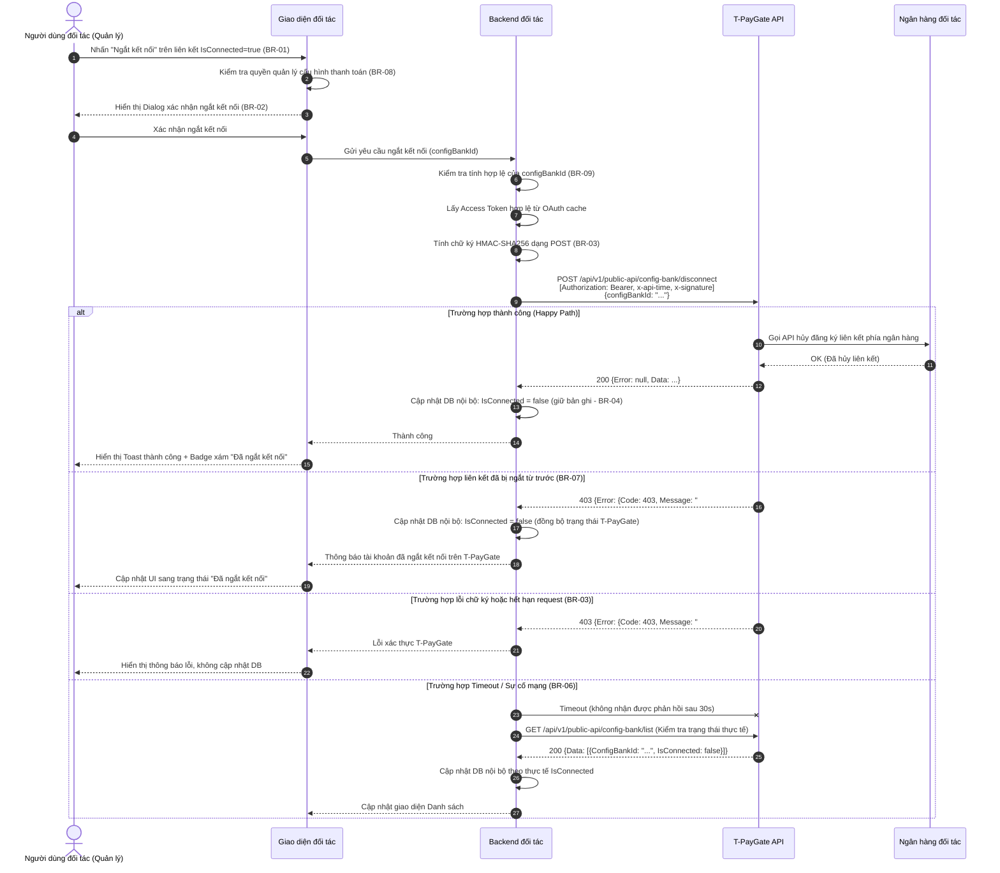
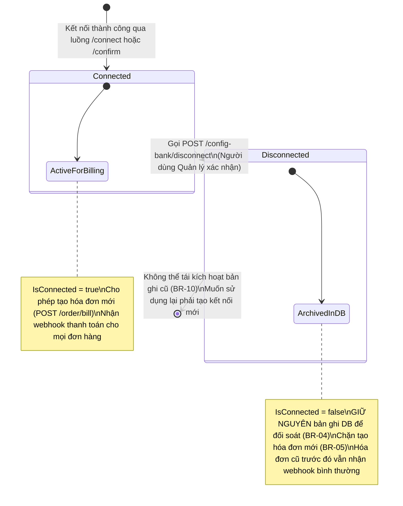

## Flow: tpaygate-disconnect-bank-activity (Activity Diagram)

> Luồng nghiệp vụ Ngắt kết nối ngân hàng đối tác — mô tả trình tự kiểm tra quyền hạn, xác nhận qua Dialog, ký HMAC-SHA256, gọi API T-PayGate và cập nhật trạng thái trong cơ sở dữ liệu.

---

## Flow: tpaygate-disconnect-bank-sequence (Sequence Diagram)

> Tương tác chi tiết giữa các thành phần hệ thống theo trình tự thời gian cho luồng Ngắt kết nối ngân hàng.

---

## Flow: tpaygate-disconnect-bank-lifecycle (State Transition Diagram)

> Sơ đồ chuyển đổi trạng thái vòng đời của một liên kết ngân hàng (`ConfigBankId`) và ảnh hưởng đến việc tạo hóa đơn thanh toán.

