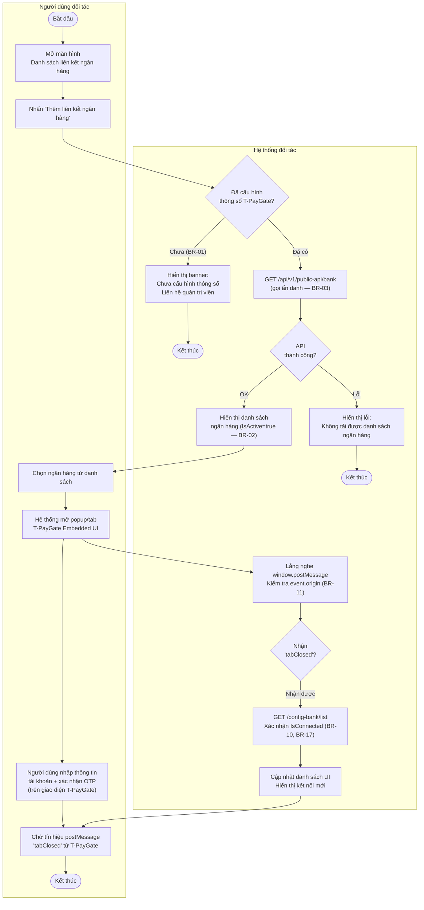
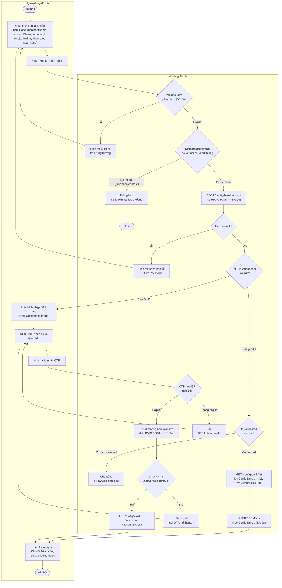
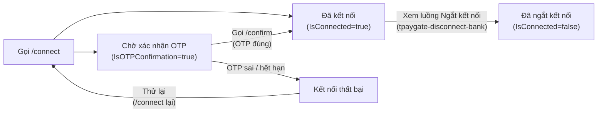
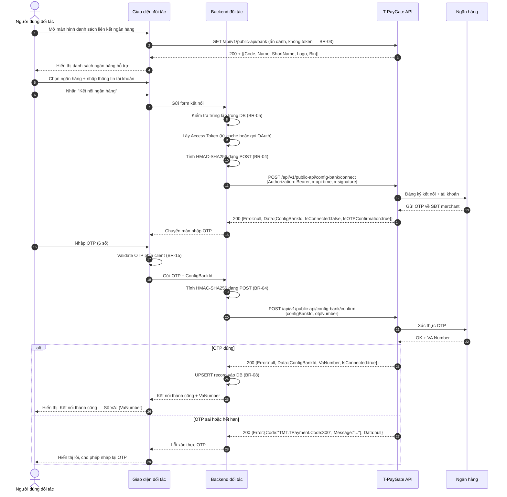

## Flow: tpaygate-connect-bank-embedded-ui (Activity Diagram)

> Luồng nghiệp vụ kết nối ngân hàng qua **Embedded UI** — T-PayGate cung cấp giao diện trong popup/tab. Phù hợp cho web app, đơn giản về phía đối tác.

---

## Flow: tpaygate-connect-bank-api-direct (Activity Diagram)

> Luồng kết nối ngân hàng qua **API trực tiếp** — đối tác tự thiết kế UI, ký HMAC-SHA256 và gọi API T-PayGate. Phù hợp cho mobile app hoặc khi cần UI tùy biến sâu.

---

## Flow: tpaygate-connect-bank-lifecycle (Activity Diagram)

> Vòng đời của một liên kết ngân hàng (`ConfigBankId`) từ khi tạo đến khi kết nối thành công. Nghiệp vụ ngắt kết nối được đặc tả riêng tại `[[docs/tpaygate-disconnect-bank/srs/flows|T-PayGate Disconnect Bank Flows]]`.

---

## Flow: tpaygate-connect-bank-sequence (Sequence Diagram)

> Tương tác chi tiết giữa các thành phần hệ thống theo thứ tự thời gian — Luồng API trực tiếp với OTP.

---

## Flow: tpaygate-disconnect-bank-sequence (Sequence Diagram)

> **Lưu ý modular BA:** Sơ đồ tương tác và trình tự chi tiết cho nghiệp vụ Ngắt kết nối ngân hàng đã được tách riêng thành tính năng độc lập `tpaygate-disconnect-bank`.
> 
> Xem đầy đủ các sơ đồ Activity, Sequence và State Transition tại: `[[docs/tpaygate-disconnect-bank/srs/flows|T-PayGate Disconnect Bank Flows]]`.
