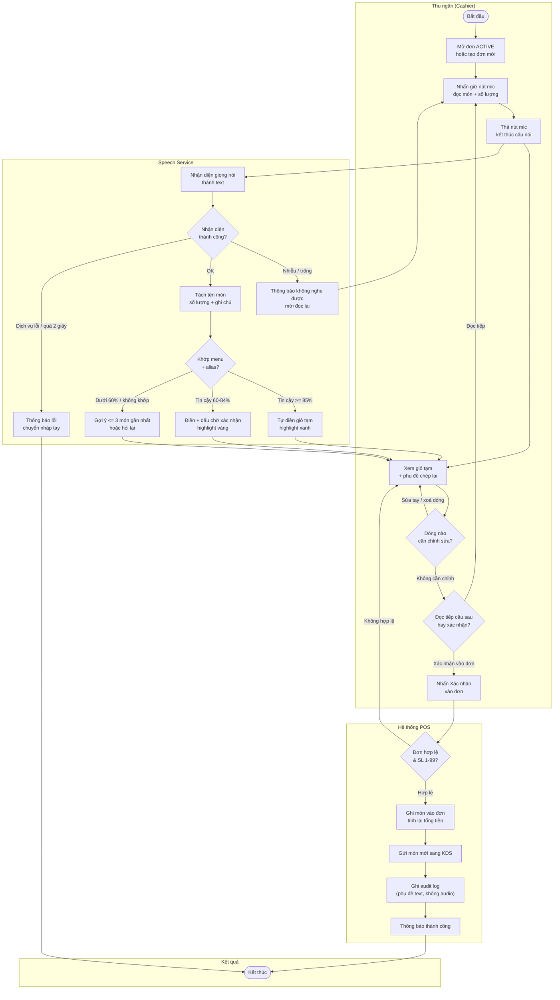
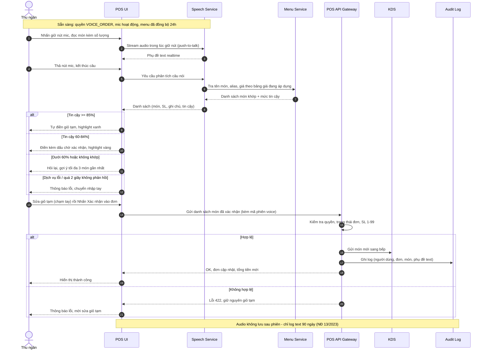

## Flow: voice-ordering-main-flow (Activity Diagram)

> Luồng nghiệp vụ tổng thể từ góc nhìn các vai trò tham gia (Swimlane).

## Flow: voice-ordering-system-sequence (Sequence Diagram)

> Tương tác chi tiết giữa thu ngân, POS và các dịch vụ trong 1 phiên đặt món bằng giọng nói.

