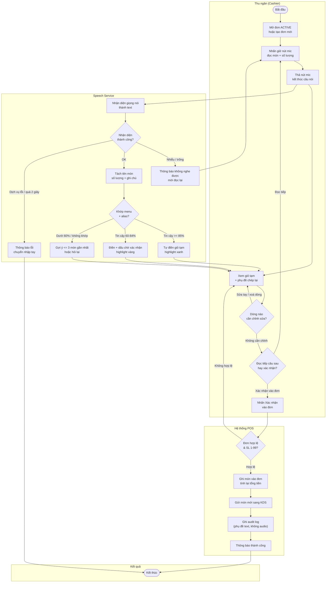
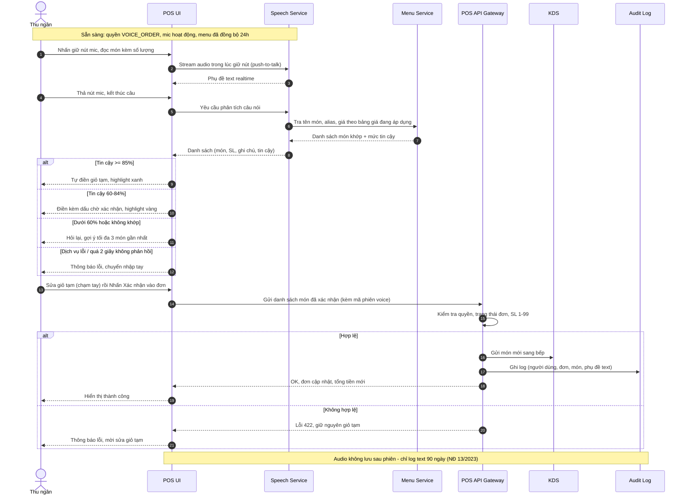

# Đặc tả tính năng: Đặt món bằng giọng nói (Voice Ordering)

## 1. Tổng quan nghiệp vụ (Business Overview)

| Thông tin nghiệp vụ | Chi tiết đặc tả |
| :--- | :--- |
| **1. Mục đích & Phạm vi** | Cho phép thu ngân **tạo/chỉnh đơn hàng bằng giọng nói tiếng Việt** trên máy POS: đọc lần lượt tên món kèm số lượng, hệ thống nhận diện giọng nói, khớp với thực đơn, điền vào **giỏ tạm** và **chỉ chính thức ghi vào đơn sau khi thu ngân xác nhận**. Mục tiêu: rút ngắn thời gian nhập đơn giờ cao điểm (benchmark ngành: giảm ~25% thời gian đặt món), giảm sai sót nghe–nhận–nhập giữa khách và nhân viên. Phạm vi: POS F&B (nhập đơn tại quầy/bàn). **Không bao gồm:** thanh toán bằng giọng nói, voice bot đặt món qua điện thoại/drive-thru, đăng nhập bằng giọng nói (voice biometric), khách tự đọc món tại quầy/kiosk (release đầu chỉ dành cho người bán — thu ngân/nhân viên). |
| **2. Actors (Tác nhân)** | **Chính:** Thu ngân (Cashier), Quản lý cửa hàng (Store Manager — định nghĩa alias món, theo dõi chất lượng nhận diện). **Hỗ trợ:** POS UI, Speech Service (nhận diện giọng nói ASR + hiểu ngôn ngữ NLU — dịch vụ ngoài), Menu Service, POS Backend (tính tiền), KDS (Kitchen Display System), Audit Log. |
| **3. Pre-conditions (Điều kiện tiên quyết)** | 1. Thu ngân có **quyền `VOICE_ORDER`** do quản trị viên cấp theo cửa hàng. 2. Micrô điện thoại/máy POS hoạt động và được cấp quyền truy cập. 3. **Bản đồ menu** (tên món + alias + giá) đã đồng bộ sang Speech Service thành công trong 24 giờ gần nhất. 4. Đơn đích đang `ACTIVE` hoặc là đơn mới tạo. 5. Kết nối mạng tới Speech Service ổn định. |
| **4. Expected Results (Kết quả mong đợi)** | **Happy Path (Luồng xử lý chính):** 1. Thu ngân mở đơn `ACTIVE` (hoặc tạo đơn mới), nhấn giữ nút mic. 2. Thu ngân đọc món kèm số lượng ("hai ly trà đá, một phở bò ít hành"). 3. Màn hình hiển thị phụ đề trực tiếp; hệ thống khớp món + alias + số lượng. 4. Món tin cậy cao tự điền vào giỏ tạm (highlight xanh); món chưa chắc điền kèm dấu chờ xác nhận (highlight vàng). 5. Thu ngân xem giỏ tạm, sửa/xoá bằng chạm tay nếu cần, nhấn **"Xác nhận vào đơn"**. 6. Hệ thống ghi món vào đơn, tính lại tổng tiền, gửi món mới sang KDS, ghi audit log.  **Alternate Branches (Luồng rẽ nhánh & Ngoại lệ):** - **[Nhánh A - Nhiễu ồn / không nghe được]:** Hệ thống không nhận diện được giọng nói → hiển thị phụ đề trống + thông báo, mời đọc lại hoặc chuyển nhập tay. - **[Nhánh B - Món không có trong thực đơn]:** Không khớp món nào ≥ 60% → thông báo "Không tìm thấy món", kèm gợi ý tối đa 3 món gần nhất; không bao giờ tự tạo món mới. - **[Nhánh C - Tên món mơ hồ]:** Câu nói khớp nhiều món gần giống nhau → hiển thị danh sách chọn bằng tay, không tự điền. - **[Ngoại lệ D - Speech Service lỗi/quá 2 giây không phản hồi]:** Thông báo lỗi, đề xuất nhập tay; đơn và giỏ tạm giữ nguyên trạng thái. - **[Ngoại lệ E - Lỗi khi ghi vào đơn]:** Rollback toàn bộ giao dịch, giữ nguyên giỏ tạm để thử lại, đơn gốc không đổi. |

---

## 2. Quy tắc nghiệp vụ cốt lõi (Core Business Rules)

| # | Quy tắc | Mô tả | Xử lý vi phạm |
| :--- | :--- | :--- | :--- |
| **BR-01** | **[Constraint] Phân quyền sử dụng voice** | Chỉ tài khoản được cấp quyền `VOICE_ORDER` (thiết lập theo từng cửa hàng) mới được dùng tính năng đặt món bằng giọng nói. | Ẩn nút mic khỏi giao diện. Nếu truy cập API trực tiếp: `HTTP 403 – PERMISSION_DENIED`. |
| **BR-02** | **[Constraint] Đơn đích hợp lệ** | Voice chỉ áp dụng cho **đơn mới tạo** hoặc đơn đang `ACTIVE`. Cấm với đơn đã thanh toán (toàn phần/một phần), đã hủy, đang giao hàng. | Disable nút mic + tooltip: _"Chỉ dùng giọng nói cho đơn đang hoạt động."_ |
| **BR-03** | **[Constraint] Phạm vi lệnh bằng giọng nói** | Voice chỉ nhận lệnh **thêm món** (kèm số lượng, ghi chú) vào giỏ tạm. Sửa/xoá dòng, tăng/giảm số lượng món đã đọc thực hiện **bằng chạm tay** trên giỏ tạm (release đầu không hỗ trợ sửa/xoá bằng giọng nói). Mọi lệnh liên quan thanh toán, giảm giá, hoàn/hủy đơn, in phiếu đều bị từ chối. | Lệnh sửa/xoá bằng giọng nói ("bỏ phở", "bớt một ly trà đá"): phản hồi _"Vui lòng chỉnh sửa bằng tay trên giỏ tạm."_ Các lệnh khác: _"Chức năng này cần thao tác tay trên màn hình."_ Không thay đổi trạng thái đơn. |
| **BR-04** | **[Constraint] Ngôn ngữ phiên nghe** | Phiên nghe mặc định **tiếng Việt** (chấp nhận phương ngữ Bắc/Trung/Nam). Tên món tiếng nước ngoài/từ lái xử lý qua alias (BR-07). | Câu không nhận diện được: hiển thị phụ đề trống, mời đọc lại hoặc chuyển nhập tay. |
| **BR-05** | **[Constraint] Chế độ ghi âm push-to-talk** | Chỉ ghi âm **trong lúc thu ngân giữ nút mic**. Không lắng nghe nền, không wake-word — giới hạn phạm vi thu âm theo Nghị định 13/2023/NĐ-CP. | Không giữ nút: không có audio nào được gửi đi. Giữ quá 60 giây: tự cắt phiên ghi và xử lý đoạn đã ghi được. |
| **BR-06** | **[Derivation] Ngưỡng tin cậy khi khớp món** | Mức tin cậy (confidence) do Speech Service trả về: **≥ 85%** tự điền giỏ tạm (highlight xanh); **60–84%** điền kèm dấu chờ xác nhận (highlight vàng); **< 60%** không điền. Mọi dòng dưới 85% phải được thu ngân chạm xác nhận trước khi vào đơn. | Dòng chưa được xác nhận không tính vào giao dịch; đóng màn hình = hủy toàn bộ giỏ tạm chưa xác nhận. |
| **BR-07** | **[Derivation] Khớp tên món và alias** | Khớp món theo **tên chính + tên gọi khác (alias)** do quản lý cửa hàng định nghĩa (VD: "phố" → Phở bò, "trà đá" → Trà đá). Alias theo từng cửa hàng, không dùng chung chuỗi. Không khớp → gợi ý tối đa 3 món gần nhất theo độ tương đồng. | Không có gợi ý nào đạt 60%: thông báo _"Không tìm thấy món trong thực đơn."_ Tuyệt đối không tự tạo món mới từ voice. |
| **BR-08** | **[Derivation] Số lượng ngôn ngữ tự nhiên** | Chuyển số lượng nói tự nhiên về số nguyên: "hai ly trà đá" → 2, "ba phần phở" → 3, "mốt" (miền Nam) → 1. Kết quả phải nằm trong khoảng **1–99**. | Không xác định được số: hỏi lại _"Bao nhiêu phần?"_, đề xuất mặc định 1. Số ngoài 1–99: từ chối dòng, yêu cầu đọc lại. |
| **BR-09** | **[Derivation] Giá và tổng tiền** | Đơn giá lấy theo **bảng giá đang áp dụng cho đơn** (giờ vàng, ngày thường, khu vực); tổng tiền giỏ tạm tính lại realtime như nhập tay. Voice không tự áp khuyến mãi. | Không lấy được giá (món chưa gắn giá): không điền món, cảnh báo _"Món chưa có giá, vui lòng kiểm tra thực đơn."_ |
| **BR-10** | **[Action Enabler] Điều kiện kích hoạt nút mic** | Nút mic chỉ enabled khi đủ: mic kết nối + quyền `VOICE_ORDER` (BR-01) + đơn hợp lệ (BR-02) + menu đã đồng bộ trong 24 giờ (BR-11). | Thiếu điều kiện nào: disable nút mic, tooltip nêu rõ lý do thiếu. |
| **BR-11** | **[Action Enabler] Đồng bộ menu** | Khi menu/alias/giá thay đổi, hệ thống tự đẩy bản đồ menu mới sang Speech Service. Đồng bộ thất bại quá 15 phút: vô hiệu voice toàn cửa hàng + cảnh báo quản lý (bán hàng nhập tay không ảnh hưởng). | Không cho dùng voice với bản đồ menu cũ để tránh khớp sai món đã đổi tên/giá. |
| **BR-12** | **[State Transition] Trạng thái phiên nghe** | `IDLE → RECORDING` (giữ nút) `→ PROCESSING` (≤ 2 giây) `→ DRAFT` (giỏ tạm) `→ CONFIRMED` (vào đơn) hoặc `FAILED`. Im lặng > 10 giây giữa các câu: vẫn giữ phiên. Đóng màn hình/thoát: hủy toàn bộ giỏ tạm chưa xác nhận, đơn không đổi. | Phiên `FAILED`: hiển thị nguyên nhân (nhiễu/timeout/dịch vụ lỗi), đề xuất đọc lại hoặc nhập tay. |
| **BR-13** | **[State Transition] Cam kết vào đơn và gửi bếp** | Món chỉ được ghi vào đơn + gửi KDS **sau** bước "Xác nhận vào đơn" của thu ngân. Xác nhận nhiều dòng cùng lúc = 1 giao dịch duy nhất (thành công hết hoặc giữ nguyên giỏ tạm). | Lỗi giữa giao dịch: rollback toàn bộ, giữ giỏ tạm để thử lại, đơn gốc không đổi. |
| **BR-14** | **[Data Validation] Gộp dòng và ghi chú** | Món đã có trong đơn, không kèm ghi chú mới → tăng số lượng dòng hiện có (theo cấu hình gộp dòng của cửa hàng). Có ghi chú ("ít cay", "không hành") → tạo dòng mới kèm ghi chú. Ghi chú tự do tối đa 100 ký tự. | Ghi chú dài quá 100 ký tự: tự cắt + cảnh báo cho thu ngân trước khi xác nhận. |
| **BR-15** | **[Data Validation] Dữ liệu giọng nói và audit** | Audio chỉ xử lý tạm thời để chuyển text, **không lưu trữ** sau khi phiên kết thúc (Nghị định 13/2023/NĐ-CP — dữ liệu giọng nói thuộc dữ liệu cá nhân nhạy cảm). Chỉ giữ log text phụ đề + kết quả khớp trong **90 ngày** phục vụ audit. Mỗi phiên ghi audit: người dùng, mã đơn, danh sách món khớp/không khớp, thời lượng phiên. | Ghi audit thất bại: giao dịch vẫn hoàn tất, ghi cảnh báo vào system log và thông báo DevOps. |
| **BR-16** | **[Constraint] Mục tiêu chất lượng theo benchmark ngành** | Độ chính xác khớp món **≥ 95%**; thời gian xử lý mỗi câu nói **≤ 2 giây**; khả dụng tính năng **≥ 99%** trong giờ mở cửa. Tuần chạy thử đầu tiên: tỷ lệ hủy giỏ tạm > 20% hoặc tỷ lệ dòng phải chạm xác nhận > 30% → cảnh báo cần bổ sung alias. | Dashboard cửa hàng cảnh báo cho quản lý; không chặn nghiệp vụ bán hàng. |

---

## 3. Sơ đồ tương tác (Interaction Diagram)

*(Các sơ đồ dưới đây được lưu đầy đủ tại `docs/voice-ordering/srs/flows.md`)*

### 3.1 Activity Diagram — Luồng nghiệp vụ đặt món bằng giọng nói

### 3.2 Sequence Diagram — Tương tác hệ thống chi tiết

*(Xem đầy đủ tại `flows.md` – Flow: voice-ordering-system-sequence)*

---

## 4. Đặc tả màn hình (Screen Specifications)

*(Đặc tả chi tiết được lưu tại `docs/voice-ordering/srs/screens.md` — sinh bởi skill `/screen`)*

![[screens.md]]

---

## 5. Phân tích đối thủ cạnh tranh (Competitive Analysis)

### KiotViet — Hệ sinh thái gọi món
- Có **QR ordering** (khách quét mã tại bàn tự đặt) và app gọi món cho nhà hàng; POS chạm màn hình tính tiền tự động.
- **Chưa có voice ordering native** trên POS tại quầy tại thời điểm khảo sát.
- **Cơ hội khác biệt hoá:** Otio đi trước với nhập đơn hands-free cho thu ngân giờ cao điểm.

### Sapo POS — Gọi món qua app di động
- Blog Sapo giới thiệu các app gọi món miễn phí có tính năng _"tạo đơn bằng giọng nói nhanh"_ — đây là app di động bên thứ ba được review, **Sapo POS native chưa có voice tại quầy** (cần verify lại trước khi ra mắt).
- **Cơ hội khác biệt hoá:** voice tích hợp sâu vào luồng POS tại quầy (khớp menu + alias + gửi bếp trực tiếp), không qua app trung gian.

### Bối cảnh nền tảng quốc tế
- Nền tảng voice ordering hàng đầu đạt **95–96% độ chính xác đơn hàng**, cắt ~25% thời gian đặt món, tự xử lý ~90% đơn không cần can thiệp (Deepgram, BiteBuddy, Pendium — xem References). Otio đặt mục tiêu chất lượng theo benchmark này (BR-16).

### Điểm khác biệt của Otio (USP)

| Tiêu chí | KiotViet | Sapo | Otio |
| :--- | :---: | :---: | :---: |
| Voice order native tại quầy POS | ❌ | ❌ | ✅ |
| Push-to-talk, không lắng nghe nền (NĐ 13/2023) | — | — | ✅ |
| Alias tên món theo từng cửa hàng | — | — | ✅ |
| Xác nhận 2 ngưỡng tin cậy trước khi vào đơn | — | — | ✅ |
| Không lưu audio, log text phục vụ audit | — | — | ✅ |
| Dashboard chất lượng nhận diện per-store | — | — | ✅ |

---

## 6. Open Questions

- [x] **OQ-01:** Đối tượng đọc món ở release đầu: **chỉ thu ngân**, hay mở thêm cho **khách tự đọc** tại quầy/kiosk? (ảnh hưởng phân quyền, UX và quy tắc xác nhận)
  - Resolved (2026-08-14): chỉ người bán đọc — thu ngân/nhân viên có quyền `VOICE_ORDER`; khách tự đọc tại quầy/kiosk không thuộc release đầu.
- [x] **OQ-02:** Có hỗ trợ **sửa/xoá bằng giọng nói** ("bỏ phở", "bớt một ly trà đá") trong release đầu không, hay release đầu chỉ nhận lệnh thêm món?
  - Resolved (2026-08-14): không hỗ trợ — voice chỉ thêm món; sửa/xoá bằng chạm tay trên giỏ tạm.
- [x] **OQ-03:** Có giữ audio **tùy chọn (opt-in)** cho cửa hàng muốn cải thiện nhận diện không (VD lưu 30 ngày có đồng ý), hay chốt luôn **không lưu** như BR-15?
  - Resolved (2026-08-14): chốt không lưu audio — không có opt-in; chỉ log text 90 ngày như BR-15.
- [ ] **OQ-04:** Ngưỡng tin cậy 85%/60% **cố định toàn hệ thống** hay cho phép quản lý cửa hàng tự cấu hình?
  - Hold (2026-08-14): resolve sau khi có dữ liệu chạy thử thực tế; downstream skill (`/usecase`, `/userstory`) inherit lại câu hỏi này.
- [ ] **OQ-05:** **Tiếng Anh / Việt-Anh lẫn** ("combo 1 Pepsi") có nằm roadmap giai đoạn sau không?
  - Hold (2026-08-14): chưa cần giai đoạn này; từ tiếng Anh trong tên món đã xử lý qua alias (BR-04). Đánh giá lại khi có nhu cầu thực tế từ cửa hàng.

---

## 7. References

- `@../../../skills/rules/approval-gate.md`
- `@../../../skills/srs/screen.md` (Skill Con phụ trách đặc tả màn hình)
- Nghị định 13/2023/NĐ-CP — Bảo vệ dữ liệu cá nhân: https://vanban.chinhphu.vn/?pageid=27160&docid=207759
- Deepgram — Voice-Automated Drive-Thru Guide: https://deepgram.com/learn/voice-automated-drive-thru
- BiteBuddy — Restaurant Voice AI Complete Guide (2026): https://bitebuddy.ai/blog/restaurant-voice-ai-guide-2026
- Pendium — Best AI Voice Ordering Systems for Restaurants: https://pendium.ai/research/best-ai-voice-ordering-systems-for-restaurants
- KiotViet: https://www.kiotviet.vn/
- Sapo Blog — App gọi món: https://blog.sapo.vn
