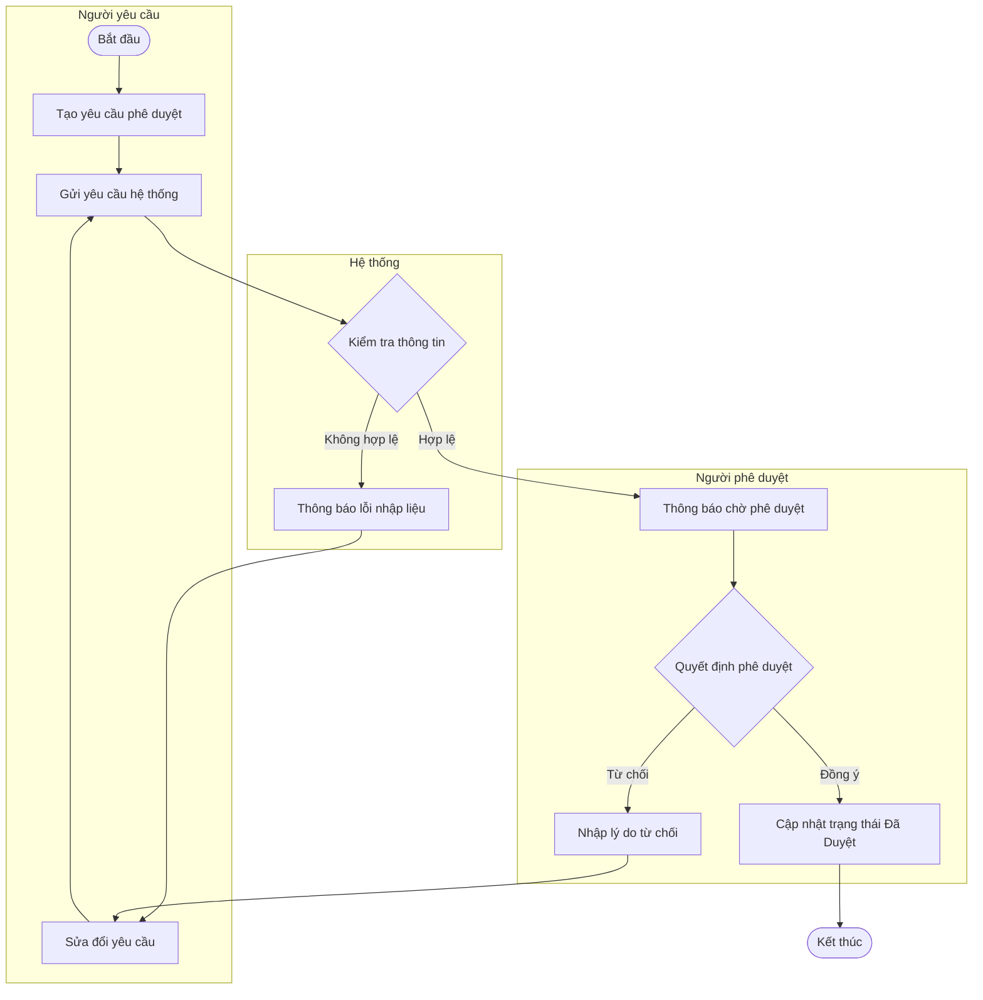

# Skill: /activity — Activity Diagram Generator (Flowchart)

## 1. Goal
Phân tích logic nghiệp vụ, xác định các điểm rẽ nhánh quyết định (Decisions), xử lý song song (Forks) hoặc các vai trò tham gia (Swimlanes) để sinh sơ đồ hoạt động (Activity Diagram) trực quan bằng cú pháp `flowchart` của Mermaid.js [1]. Kết quả được cập nhật trực tiếp vào phân đoạn luồng của tính năng (`docs/{feature}/srs/flows.md`) [1].

## 2. Constraints (Ràng buộc cứng)
1. **Quy định tệp tin đầu ra:** Ghi nhận hoặc append output vào duy nhất tệp `docs/{feature}/srs/flows.md` [1]. Sơ đồ Activity và Sequence diagram dùng chung tệp tin này [1]. Mỗi sơ đồ là một phân đoạn bắt đầu bằng tiêu đề `## Flow: {Tên quy trình}` [1].
2. **Cơ chế Approval Gate:**
   - **L1 Plan:** Trước khi tiến hành ghi hoặc sửa đổi file, bắt buộc in ra bản xem trước (Preview) gồm: Đường dẫn file mục tiêu, hành động (tạo mới/append), danh sách các tác nhân/hệ thống và tóm tắt các điểm quyết định cốt lõi. Chờ người dùng phản hồi `Y/n` [1].
   - **L2 Diff:** Nếu thực hiện sửa đổi có tham số `--update`, phải hiển thị cấu trúc thay đổi (unified diff) giữa mã cũ và mới [1]. Chờ xác nhận `Y/n` [1].
   - **L3 Iterate (Không áp dụng):** Sơ đồ không hiển thị trực tiếp trong terminal/chat, người dùng sẽ tự xem sơ đồ sau khi ghi và chạy lại lệnh kèm flag `--update` để điều chỉnh [1].
3. **Từ chối nếu thiếu `--update`:** Nếu phân đoạn luồng (`## Flow: <Title>`) hoặc tệp `flows.md` đã tồn tại mà lệnh gọi thiếu flag `--update`, phải dừng xử lý và yêu cầu người dùng bổ sung [1].
4. **Changelog Routing (v2.6):**
   - File `flows.md` sử dụng slim frontmatter (không chứa trường `changelog` riêng) [1].
   - Nhật ký thay đổi từ lệnh `/activity` phải được chuyển hướng (route) trực tiếp về tệp đặc tả cấu trúc cha: `docs/{feature}/srs/spec.md` [1].
   - Tiền tố ghi nhận bắt buộc: `[flows]` [1].
   - Định dạng dòng log: `- YYYY-MM-DD | /activity | [flows] added <flow-name> activity, <n> decisions` [1].

## 3. Inputs
Cú pháp lệnh hợp lệ:
- Khởi tạo lần đầu: `/activity "<desc>" --feature <slug>` [1]
- Cập nhật luồng đã có: `/activity "<desc>" --feature <slug> --update` [1]

## 4. Context (Dynamic)
Các lệnh kiểm tra tài nguyên hệ thống trong lúc vận hành:
- Ngày hiện tại: !`date +%Y-%m-%d` [1]
- Danh sách các tệp flows hiện có: !`for d in docs/*/srs/flows.md; do [ -f "$d" ] && echo "$d"; done` [1]
- Kiểm tra các tệp spec để chuẩn bị route changelog: !`for d in docs/*/srs/spec.md; do [ -f "$d" ] && echo "$d"; done` [1]

## 5. Approach (Quy trình thực hiện)
1. **Phân tích đối số:** Trích xuất thông tin đầu vào `<desc>`, mã tính năng `--feature <slug>`, và trạng thái sửa đổi `--update` [1].
2. **Kiểm tra nghiệp vụ (Decision Matrix):**
   - Đảm bảo quy trình nghiệp vụ phù hợp với sơ đồ hoạt động: Có từ 3 nhánh quyết định trở lên, có xử lý song song, hoặc có các vòng lặp xử lý phức tạp [1].
   - Nếu luồng xử lý quá đơn giản (ít hơn 3 nhánh rẽ quyết định và mang tính tuần tự thời gian), đề xuất người dùng chuyển sang sử dụng `/sequence` [1].
3. **Thiết kế sơ đồ hoạt động (Flowchart):**
   - Sử dụng hướng vẽ dọc (`flowchart TB`) hoặc ngang (`flowchart LR`) tùy vào số lượng bước [1].
   - Xác định điểm bắt đầu (Start - hình tròn) và kết thúc (End - hình tròn kép).
   - Xác định các bước xử lý (Action - hình chữ nhật) [1].
   - Xác định các khối kiểm tra điều kiện (Decision - hình thoi).
   - Nếu có nhiều vai trò/hệ thống tham gia, phân vùng rõ ràng bằng cách sử dụng cấu trúc `subgraph` đóng vai trò là các Swimlanes (phân làn xử lý) [1].
4. **L1 Plan Approval:**
   - Trình bày kế hoạch ghi/sửa đổi tệp và chờ người dùng đồng ý (`Y/n`) [1].
5. **Thực thi Write / Append:**
   - Ghi nội dung vào tệp `docs/{slug}/srs/flows.md`. Nếu tệp chưa có, khởi tạo với slim frontmatter và thêm tiêu đề `## Flow: {Tên quy trình}` kèm mã Mermaid [1].
6. **Changelog Routing:**
   - Cập nhật dòng lịch sử vào trường `changelog` thuộc frontmatter của tệp `docs/{slug}/srs/spec.md` với tiền tố `[flows]` [1].
7. **Báo cáo kết quả:** Xác nhận việc ghi file thành công và hướng dẫn xem tài liệu [1].

## 6. Mermaid Flowchart Syntax Safety (Quy tắc an toàn cú pháp)
Cú pháp của trình phân dịch Mermaid Flowchart cực kỳ nghiêm ngặt [1]. Vi phạm sẽ gây crash toàn bộ tài liệu [1]. Hãy tuân thủ tuyệt đối các nguyên tắc sau:
1. **Cấm lồng dấu ngoặc kép đôi (`"..."`) bên trong các khối định dạng hình:**
   - SAI: `A[Nhập "Mã xác thực"]` [1]
   - ĐÚNG: `A[Nhập mã xác thực]` hoặc sử dụng mô tả không chứa dấu ngoặc kép [1].
2. **Ký tự xuống dòng:** Sử dụng thẻ ` ` để ngắt dòng văn bản bên trong các khối nhãn. KHÔNG sử dụng ký tự `\n` [1].
3. **Ký tự đặc biệt:** Nếu bắt buộc phải dùng các ký tự như ngoặc đơn `()`, ngoặc vuông `[]` hay ngoặc nhọn `{}` bên trong văn bản nhãn, hãy tiến hành escape bằng mã ASCII của ký tự đó (ví dụ: `#40;` và `#41;` cho cặp ngoặc đơn) [1].

## 7. Mermaid Flowchart Reference (Mẫu chuẩn)
Mẫu sơ đồ hoạt động chuẩn hóa quy trình phê duyệt yêu cầu (có swimlanes và rẽ nhánh):

